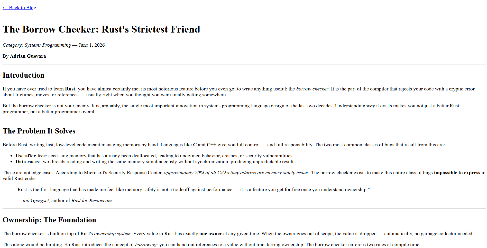

# 04 - Blog Article 📝

A simple blog article page built with semantic HTML.

This project focuses on practicing text-level semantic elements used in articles, such as emphasis, strong importance, quotations, dates, and citations.

The goal was to create a basic article structure while using HTML elements that describe the meaning of the content more clearly.

## Preview




## Features

- Semantic blog article layout
- Emphasized text using `<em>`
- Important text using `<strong>`
- Quote section using `<blockquote>`
- Date markup using `<time>`
- Citation using `<cite>`
- Clean reading structure

## Technologies Used

- HTML5
- CSS3

## What I Practiced

In this project, I practiced semantic HTML for long-form text content.

I used `<em>` to emphasize words or phrases, and `<strong>` to mark content with strong importance.

I also used `<blockquote>` for quoted content and `<cite>` to reference the source or author of the quote.

For dates, I used the `<time>` element to make the date more meaningful in the HTML structure.

```html
<time datetime="2026-06-01">June 1, 2026</time>