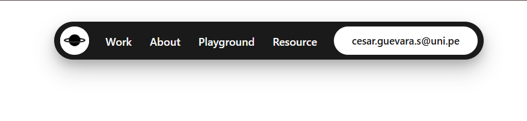
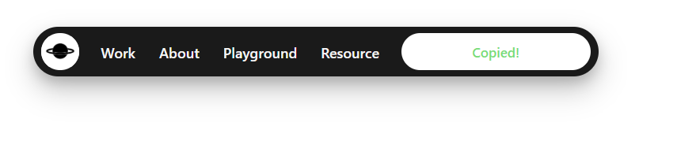

# Project 07: Navigation Bar 🧭

A vanilla HTML/CSS/JavaScript navbar component focused on practicing layout composition, microinteractions, hover states, and clipboard feedback behavior.

## 👁️ Interface Views

---

## 🕵️‍♂️ Challenges & Lessons Learned

### 1. Controlled Microinteractions

* **The Problem:** The navbar needed to feel interactive without becoming visually overloaded.
* **The Lesson:** Small animations, such as a subtle 2px floating logo effect and a soft link glow, can make the UI feel alive while keeping the design clean and elegant.

### 2. Persistent Clipboard State

* **The Problem:** The "Copied!" feedback worked on hover, but when the pointer left the button, the text returned to its default position too quickly.
* **The Lesson:** `:hover` only represents the current pointer state. A JavaScript-controlled `.is-copied` class was added to keep the success feedback visible for 1500ms after clicking.

### 3. Sliding Text Animation

* **The Problem:** The clipboard button needed two text states inside the same visual space.
* **The Lesson:** The text wrapper uses a controlled height, vertical layout, `overflow: hidden`, and `translateY()` to create a smooth label transition.

### 4. Inline-Block for Animation Control

* **The Problem:** Inline elements behave like normal text, which makes movement and transform-based animations harder to control precisely.
* **The Lesson:** `inline-block` allows elements to stay inline while also behaving like controllable boxes, making it useful for hover effects and UI motion.

### 5. Visual Balance

* **The Problem:** Strong shadows, large gaps, and intense effects could make the navbar feel heavy or exaggerated.
* **The Lesson:** Reducing spacing, softening shadows, and keeping animations subtle helped the navbar feel more premium and intentional.

---

## 🛠️ Technologies & Techniques

* **HTML5:** Semantic navigation structure.
* **CSS:** Flexbox, custom properties, shadows, transitions, keyframes, and hover states.
* **JavaScript:** Clipboard API, `async/await`, `try...catch`, `classList`, and timed UI feedback.
* **UI/UX Practice:** Microinteractions, visual hierarchy, feedback states, and reduced cognitive load.

---

## ✅ Final Result

This project helped me understand how small UI details can improve the feel of a component. The final navbar combines clean layout, subtle animation, clipboard feedback, and controlled interaction states.