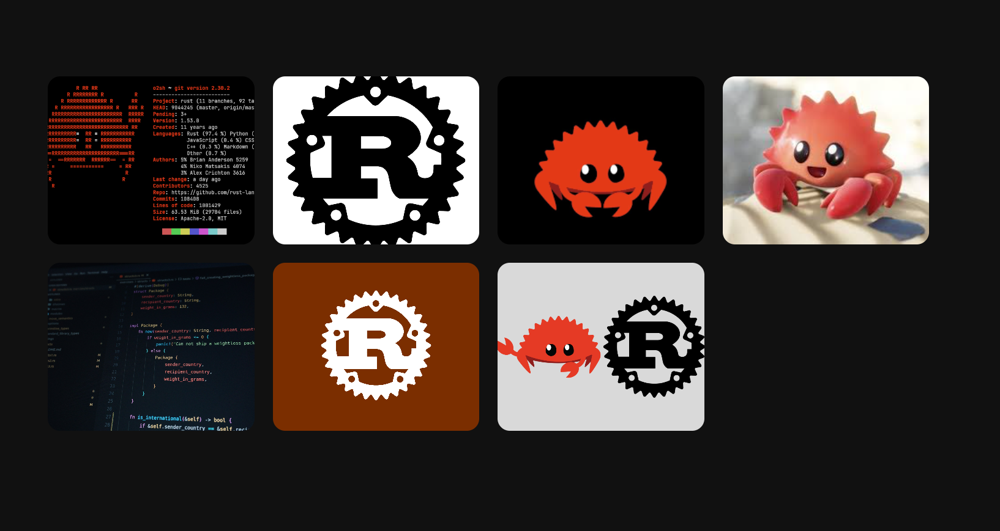

# Project 08: Photo Gallery Grid 🦀

I made a photo grid that looks like Rust and Ferris. It's a grid that shows pictures in a way.

I built this as a fun project to get better at using HTML, CSS and JavaScript. I wanted to learn more about CSS Grid. So I made a gallery with pictures of sizes. It has a background and looks clean.

## Preview



## Features

* The grid looks good on any device.

* The pictures are arranged in a way like a mosaic.

* The gallery is about Rust and Ferris.

* The background is dark and nice.

* Each picture card is different.

* When you hover over a picture it looks smooth.

* The HTML and CSS are simple and clean.

## Technologies Used

* HTML5

* CSS3

* CSS Grid

## What I Learned

I practiced using CSS Grid. I learned about:

* Making a grid with `display: grid`.

* Repeating things with `repeat()`.

* Making grids that fit with `auto-fit` and `auto-fill`.

* Setting maximum sizes with `minmax()`.

* Making rows the size with `grid-auto-rows`.

* Making things take up a number of rows with `grid-row: span X`.

* Making it look good on devices.

* Fitting pictures, with `object-fit: cover`.

## Main Challenge

The hardest part was making the pictures look like a mosaic.

I tried making rows with:

```css

grid-auto-rows: 10px;

```