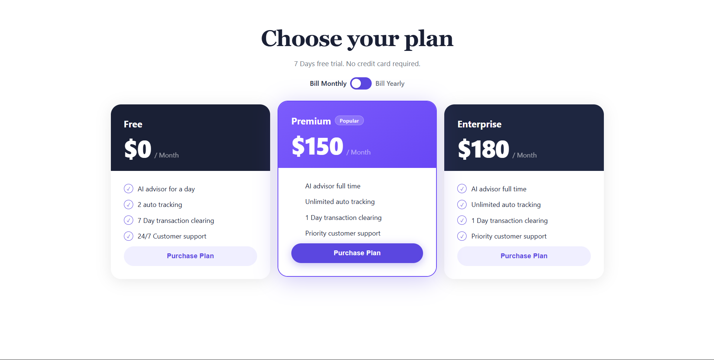
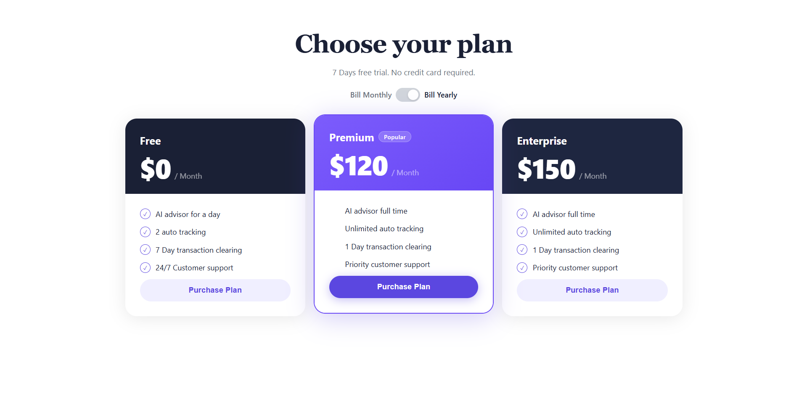

# 10 - Pricing Component 💳

A responsive pricing cards component built with vanilla HTML, CSS, and JavaScript.

This project focuses on creating a clean pricing section with a monthly/yearly billing toggle. The main goal was to practice UI state management using a styled checkbox input, `data-*` attributes, and `classList` to update the interface dynamically.

## Preview





## Features

- Responsive pricing cards layout
- Monthly/yearly billing toggle
- Styled checkbox input
- Dynamic price updates with JavaScript
- Active billing label state
- Highlighted premium plan
- Clean card-based UI
- Vanilla HTML, CSS, and JavaScript only

## Technologies Used

- HTML5
- CSS3
- JavaScript
- CSS Flexbox
- CSS Grid
- Custom form styling
- `data-*` attributes
- `classList`

## What I Practiced

In this project, I practiced how to control UI state using a checkbox input styled with CSS.

The billing toggle works as an `input type="checkbox"`. When the checkbox state changes, JavaScript reads whether it is checked or not, then updates the pricing values depending on the selected billing mode.

I also practiced using `data-monthly` and `data-yearly` attributes to store both price values directly in the HTML.

```html
<span class="price-amount" data-monthly="$150" data-yearly="$120">$150</span>