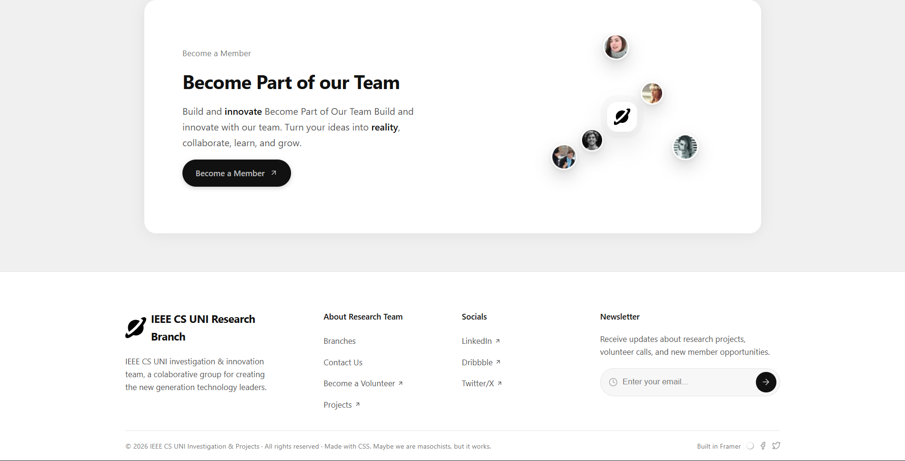

# 10 - Footer Component 🚀

A modern CTA and footer component built with vanilla HTML and CSS.

This project focuses on creating a clean call-to-action section combined with a structured footer layout. The visual idea was to make the section feel modern, soft, and interactive by using floating avatars, orbital motion, responsive spacing, and a newsletter-style input.

## Preview




## Features

- Modern call-to-action card
- Responsive footer layout
- Floating avatar orbit animation
- CSS keyframe animations
- Responsive orbit radius for desktop, tablet, and mobile
- Newsletter input design
- Clean spacing and visual hierarchy
- Vanilla HTML and CSS only

## Technologies Used

- HTML5
- CSS3
- CSS Flexbox
- CSS Grid
- CSS Animations
- Media Queries

## What I Practiced

In this project, I practiced how to build a more polished footer section using only HTML and CSS.

The main focus was not only the footer itself, but also the animated visual element inside the CTA card. I worked with CSS `@keyframes` to create movement and rotation effects for the orbiting avatars.

I also practiced responsive design by adjusting the orbit radius with media queries, so the animation keeps a good proportion on desktop, tablet, and mobile screens.

## Main Challenge

The main challenge was making the orbit animation responsive.

At first, the avatars looked good on desktop, but the orbit radius was too large for smaller screens. To fix this, I adjusted the distance of the orbit using media queries.

This helped me understand that animations also need responsive behavior. It is not enough to make only the layout responsive; moving elements also need to adapt to different screen sizes.

## Key Lessons Learned

### 1. CSS keyframes can create orbital motion

I learned how to use `@keyframes` with `rotate()` and `translateX()` to create an orbit-like movement around a center icon.

```css
@keyframes orbit {
  from {
    transform: rotate(0deg) translateX(90px) rotate(0deg);
  }

  to {
    transform: rotate(360deg) translateX(90px) rotate(-360deg);
  }
}