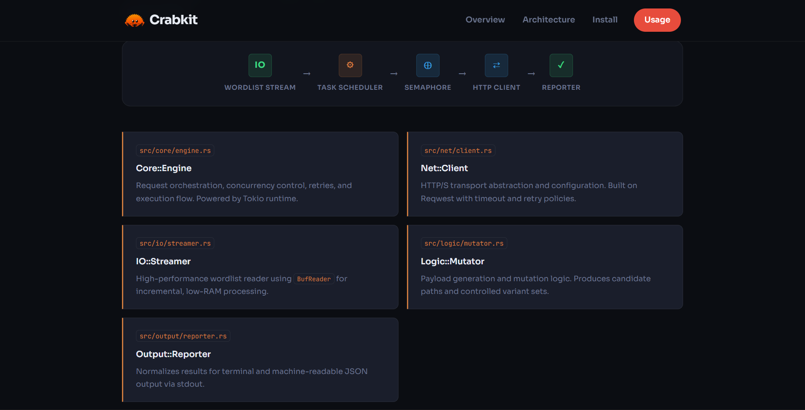
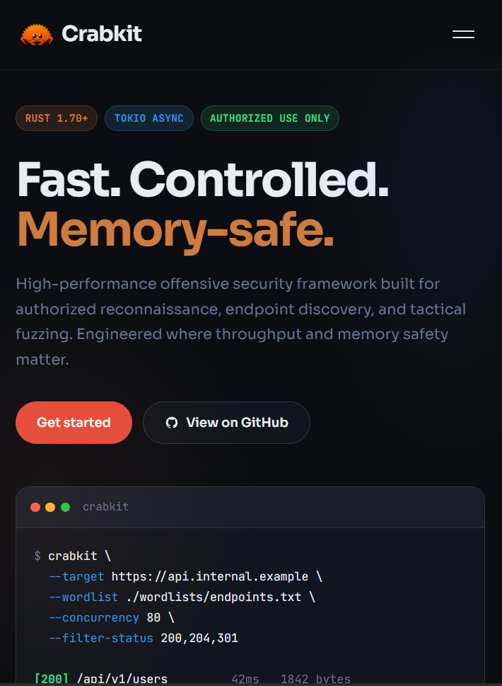

# 11 - Mobile First Landing Page

A responsive mobile-first landing page built with **HTML, CSS, and vanilla JavaScript**.

This project focuses on creating a modern landing page experience that works smoothly on mobile devices first, then adapts naturally to larger screens. The main goal was to practice responsive layout, interactive navigation behavior, smooth scrolling, and clean JavaScript event handling.

## Preview

### Desktop




### Mobile



## Overview

This landing page was built following a **mobile-first approach**, which means the design and layout were first optimized for small screens and then progressively improved for desktop views.

The page includes a responsive navigation menu, animated interactions, smooth scrolling between sections, and behavior that allows the mobile menu to close when the user clicks outside of it.

## Features

- Mobile-first responsive layout.
- Responsive navigation menu.
- Toggle button for opening and closing the mobile menu.
- Smooth scroll behavior for internal anchor links.
- Automatic menu closing after clicking a navigation link.
- Menu closes when clicking outside the toggle or menu area.
- JavaScript event handling with `stopPropagation()`.
- Clean separation between open and close menu logic.

## Technologies Used

- HTML5
- CSS3
- Vanilla JavaScript

## Main Challenge

The biggest challenge in this project was controlling how click events behave across the page, especially in the mobile navigation menu.

At first, when clicking the toggle button, the click event could bubble up to the document. This created unwanted behavior because the global document click listener could also react to the same click. As a result, the menu could open and instantly close, or trigger logic that should only run when clicking outside the menu.

To solve this, I used `stopPropagation()` inside the toggle click event.

```js
if (toggle && menu) {
    toggle.addEventListener("click", (e) => {
        // Prevent click from bubbling up to document
        e.stopPropagation();

        const isOpen = menu.classList.contains("is-active");

        if (isOpen) {
            closeMenu();
        } else {
            openMenu();
        }
    });
}
```

This prevents the click from bubbling up to the entire document and keeps the menu behavior controlled. Instead of letting the same interaction trigger both the toggle logic and the global document listener, the menu opens and closes in a predictable way.

## Smooth Scroll Behavior

Another important part of this project was improving the navigation experience when clicking internal links.

Instead of jumping instantly to each section, I added smooth scrolling using `scrollIntoView()`.

```js
target.scrollIntoView({
    behavior: "smooth",
    block: "start"
});
```

This makes the page feel more polished and avoids the rough automatic jump that usually happens with default anchor behavior.

```js
document.querySelectorAll('a[href^="#"]').forEach(link => {
    link.addEventListener("click", (e) => {
        const target = document.querySelector(link.getAttribute("href"));

        if (target) {
            // Prevent default behavior and smoothly scroll to the target section
            e.preventDefault();
            target.scrollIntoView({ behavior: "smooth", block: "start" });
            closeMenu();
        }
    });
});
```

After clicking a navigation link, the menu also closes automatically. This is especially useful on mobile because it prevents the menu from staying open and covering the content after navigation.

## Closing the Menu When Clicking Outside

I also implemented a behavior where the mobile menu closes when the user clicks outside of the menu or toggle button.

This makes the navigation feel more natural, similar to real mobile interfaces. If the menu is active and the user taps anywhere outside of it, the menu gets deactivated.

```js
document.addEventListener("click", (e) => {
    const isClickInside = menu.contains(e.target) || toggle.contains(e.target);

    if (!isClickInside && menu.classList.contains("is-active")) {
        closeMenu();
    }
});
```

This was useful to make the mobile menu feel complete, not just functional. The user does not need to press the toggle again to close it; tapping outside also works.

## What I Learned

Through this project, I practiced how to build a more realistic mobile navigation system using vanilla JavaScript.

I learned that responsive design is not only about making elements fit on smaller screens. It is also about controlling user interactions properly, especially when multiple click events can affect the same component.

The most important lessons were:

- How event bubbling works in JavaScript.
- Why `stopPropagation()` is useful in interactive components.
- How to detect clicks outside of a specific element.
- How to create smooth scrolling for anchor navigation.
- How to close a mobile menu after navigation.
- How to structure JavaScript logic using helper functions like `openMenu()` and `closeMenu()`.

## Final Thoughts

This project helped me understand that a landing page needs more than just a good layout. Small interaction details, like smooth scrolling and closing the menu when clicking outside, make the page feel much more polished and closer to a real product website.

The main improvement was learning how to control event behavior correctly so the mobile navigation works naturally and does not trigger unwanted actions.

One important clarification: `stopPropagation()` does not reduce server load directly because these interactions happen in the browser. Its real purpose here is to prevent unnecessary client-side event execution and avoid unwanted behavior caused by event bubbling.