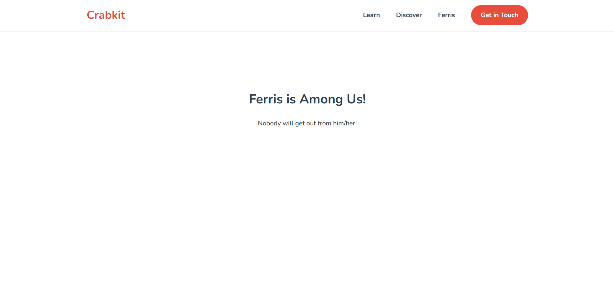
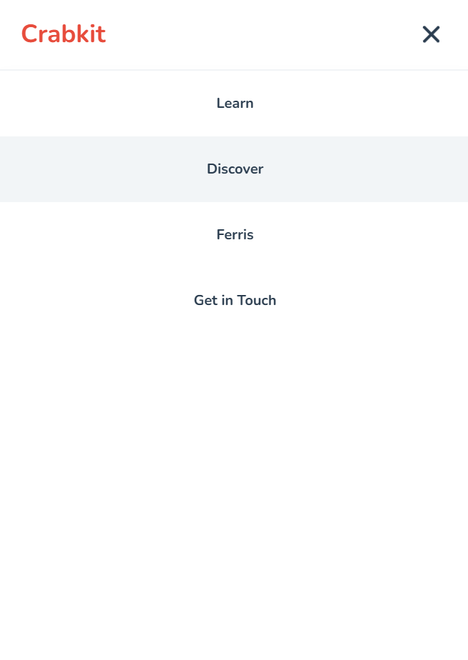

# Project 11 — Responsive Hamburger Navbar

A clean and playful responsive navigation bar built with **HTML, CSS, and JavaScript**.

This project focuses on creating a navbar that adapts between desktop and mobile layouts. On desktop, the navigation links are displayed horizontally. On smaller screens, the menu collapses into a hamburger button that opens and closes the mobile menu.

## Preview




## Features
The navbar includes:

- A responsive desktop/mobile layout
- Hamburger-to-X animation
- Mobile dropdown menu
- Sticky navbar behavior
- Accessible focus styles
- `aria-expanded` handling with JavaScript
- Reduced motion support using `prefers-reduced-motion`

## What I Built

The goal was to practice how a real responsive navbar works without relying on frameworks.

The layout has:

- A brand/logo section
- A hamburger toggle button
- A navigation menu
- A CTA link
- CSS transitions for the toggle animation
- Media queries for switching between mobile and desktop

The CSS uses custom properties for colors, spacing, transitions, font family, and navbar height, which makes the component easier to maintain and customize. :contentReference[oaicite:0]{index=0}

## Main Challenge

The funniest bug was that when I resized the page, the mobile menu opened even though I had not clicked the toggle button.

At first, I was checking something like:

```js
const isActive = navbarToggle.getAttribute('aria-controls');