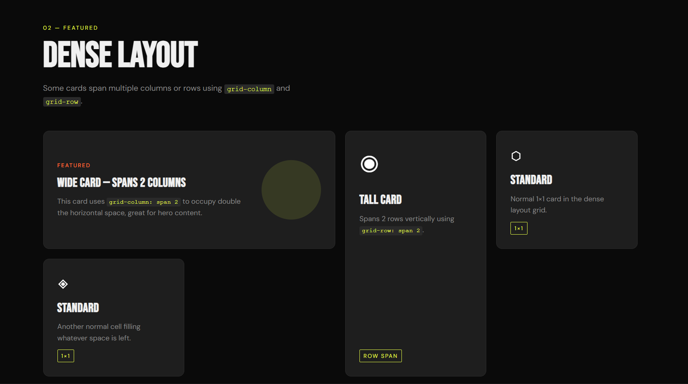

# 13 - Flexible Card Grid

A responsive card grid layout built with **HTML and CSS** using `auto-fit`, `minmax()`, and responsive units.

This project explores how CSS Grid can create flexible, responsive layouts without writing a single media query. The focus was on understanding how `auto-fit` and `minmax()` work together, how different responsive units behave, and how cards can span multiple columns or rows using grid placement properties.

## Preview



## Overview

The layout is built using **CSS Grid's intrinsic sizing capabilities**, meaning the browser itself determines how many columns fit at any given viewport width. Instead of defining breakpoints like "3 columns on desktop, 2 on tablet, 1 on mobile", the grid adapts naturally to available space.

The page includes three sections: a basic auto-fit grid, a dense layout with spanning cards, and a unit comparison section demonstrating how `%`, `rem`, `vw`, and `px` behave as minimum sizes inside `minmax()`.

## Features

- Responsive grid with zero media queries using `auto-fit` and `minmax()`.
- Cards that span multiple columns with `grid-column: span 2`.
- Cards that span multiple rows with `grid-row: span 2`.
- Dense grid packing with `grid-auto-flow: dense`.
- Visual unit comparison: `%`, `rem`, `vw`, and `px`.
- Hover effects and transitions.
- Dark, editorial design with `Bebas Neue` display font.

## Technologies Used

- HTML5
- CSS3 (CSS Grid, CSS Variables, Custom Properties)

## Main Concept: `auto-fit` vs `auto-fill`

The core of this project is the difference between `auto-fit` and `auto-fill`.

```css
/* auto-fit — stretches existing items to fill remaining space */
grid-template-columns: repeat(auto-fit, minmax(260px, 1fr));

/* auto-fill — keeps empty columns if space allows */
grid-template-columns: repeat(auto-fill, minmax(260px, 1fr));
```

With `auto-fit`, if there are only two cards in a three-column grid, those two cards expand to fill the full row. With `auto-fill`, empty column tracks are preserved instead. This project uses `auto-fit` to avoid orphaned space.

## How `minmax()` Works

`minmax(min, max)` defines a size range for each column track.

```css
grid-template-columns: repeat(auto-fit, minmax(260px, 1fr));
```

- The minimum is `260px` — a column will never shrink below this.
- The maximum is `1fr` — each column expands equally to fill leftover space.
- The browser calculates how many columns fit, then stretches them to fill the row.

This replaces the classic pattern of writing multiple breakpoints:

```css
/* Old approach — explicit breakpoints */
@media (min-width: 768px) { .grid { grid-template-columns: repeat(2, 1fr); } }
@media (min-width: 1024px) { .grid { grid-template-columns: repeat(3, 1fr); } }

/* New approach — intrinsic sizing */
.grid { grid-template-columns: repeat(auto-fit, minmax(260px, 1fr)); }
```

## Spanning Cards

The dense layout section demonstrates how individual cards can break out of the default 1×1 cell size.

```css
/* Span 2 columns horizontally */
.card--wide {
  grid-column: span 2;
}

/* Span 2 rows vertically */
.card--tall {
  grid-row: span 2;
}
```

Combined with `grid-auto-flow: dense`, the grid fills in smaller cards around larger ones instead of leaving empty gaps.

```css
.grid--dense {
  grid-auto-flow: dense;
}
```

## Responsive Units Comparison

The third section shows how different units behave as the minimum inside `minmax()`:

| Unit | Example | Behavior |
|---|---|---|
| `px` | `minmax(240px, 1fr)` | Fixed minimum, never changes |
| `rem` | `minmax(18rem, 1fr)` | Relative to root font size |
| `%` | `minmax(30%, 1fr)` | Relative to container width |
| `vw` | `minmax(20vw, 1fr)` | Relative to viewport width |

Each has different trade-offs. `px` and `rem` are more predictable; `%` and `vw` are more fluid but can create very small or very large columns depending on context.

## What I Learned

- How `auto-fit` and `minmax()` eliminate most layout breakpoints.
- The difference between `auto-fit` and `auto-fill` and when to use each.
- How to use `grid-column: span N` and `grid-row: span N` to create editorial layouts.
- How `grid-auto-flow: dense` reorders items to fill gaps left by spanning elements.
- How different responsive units (`px`, `rem`, `%`, `vw`) behave inside `minmax()`.
- How to design a grid system that works at any viewport without explicit breakpoints.

## Final Thoughts

CSS Grid's intrinsic sizing is one of the most powerful layout tools available in modern CSS. The combination of `auto-fit` and `minmax()` handles most responsive layout needs with a single line of CSS, removing the need to manage breakpoints manually.

The key insight is that `minmax()` defines *bounds*, not fixed sizes. The browser then fits as many columns as possible within those bounds, making the layout inherently adaptive without explicit intervention.