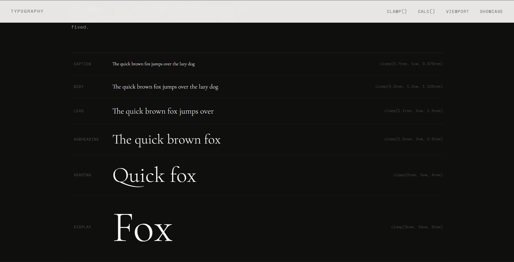

# 14 - Adaptive Typography

A typographic system built with **HTML and CSS** using `clamp()`, `calc()`, and viewport units for fluid, responsive font sizing.

This project explores modern CSS techniques for making type scale naturally across any screen size — from a 320px phone to a 2560px desktop monitor — without writing a single breakpoint. The focus was on understanding the difference between `clamp()`, `calc()`, and raw viewport units, and how they can be combined into a coherent type system.

## Preview



## Overview

Adaptive typography means type that adjusts fluidly to its environment rather than snapping between fixed sizes at arbitrary breakpoints. This project demonstrates three core techniques: `clamp()` for bounded fluid sizing, `calc()` for linear interpolation between two sizes across a viewport range, and viewport units for display text that breathes with the screen.

The design uses `Cormorant Garamond` as a refined serif display font and `Space Mono` for labels and code, creating an editorial tone that keeps the typography itself as the focus.

## Features

- Fluid type scale using `clamp()` across all heading levels.
- Linear font interpolation formula with `calc()`.
- Viewport units demonstration: `vw`, `vh`, `vmin`, `vmax`.
- Live type scale showcase from caption to display.
- Annotated article example showing the system in real content.
- Accessible contrast with clean light and dark sections.
- Zero JavaScript, zero breakpoints for font sizing.

## Technologies Used

- HTML5
- CSS3 (Custom Properties, `clamp()`, `calc()`, viewport units)

## Core Technique 1: `clamp()`

`clamp(min, preferred, max)` is the most practical tool for fluid typography. It accepts three arguments and returns a value constrained within a range.

```css
/* Syntax */
font-size: clamp(minimum, preferred, maximum);

/* Example: heading that never goes below 1.5rem or above 3.5rem */
font-size: clamp(1.5rem, 4vw, 3.5rem);
```

On a small screen, the result clamps to `1.5rem`. On a large screen, it clamps to `3.5rem`. In between, it scales fluidly with the viewport. This replaces the old pattern of stacking media queries:

```css
/* Old pattern */
h2 { font-size: 1.5rem; }
@media (min-width: 768px)  { h2 { font-size: 2rem; } }
@media (min-width: 1280px) { h2 { font-size: 3.5rem; } }

/* New pattern */
h2 { font-size: clamp(1.5rem, 4vw, 3.5rem); }
```

### Type Scale Used in This Project

| Level | `clamp()` Expression | Range |
|---|---|---|
| Display | `clamp(3rem, 10vw, 8rem)` | 48px → 128px |
| Heading | `clamp(2rem, 5vw, 4rem)` | 32px → 64px |
| Subheading | `clamp(1.5rem, 3vw, 2.5rem)` | 24px → 40px |
| Lead | `clamp(1.1rem, 2vw, 1.5rem)` | 17.6px → 24px |
| Body | `clamp(0.9rem, 1.2vw, 1.125rem)` | 14.4px → 18px |
| Caption | `clamp(0.7rem, 1vw, 0.875rem)` | 11.2px → 14px |

## Core Technique 2: `calc()` for Linear Interpolation

Before `clamp()` was widely supported, the standard approach to fluid typography used a `calc()` formula to interpolate linearly between two font sizes across a defined viewport range.

```css
/* General formula */
font-size: calc([min-size]px + ([max-size] - [min-size]) * (100vw - [min-vp]px) / ([max-vp] - [min-vp]));

/* Concrete example: 16px at 320px viewport → 24px at 1280px viewport */
font-size: calc(16px + (24 - 16) * (100vw - 320px) / (1280 - 320));
```

Breaking it down:

- `16px` — starting font size at the minimum viewport
- `(24 - 16)` — total growth range (8 units)
- `(100vw - 320px)` — how far we are from the minimum viewport
- `(1280 - 320)` — total viewport range (960 units)

This formula results in an exact linear progression from 16px to 24px. Today, this is usually wrapped in `clamp()` to add minimum and maximum bounds:

```css
font-size: clamp(16px, calc(16px + (24 - 16) * (100vw - 320px) / 960), 24px);
```

## Core Technique 3: Viewport Units

Viewport units set font size as a percentage of the browser window.

| Unit | Meaning |
|---|---|
| `vw` | 1% of viewport width |
| `vh` | 1% of viewport height |
| `vmin` | 1% of the smaller viewport dimension |
| `vmax` | 1% of the larger viewport dimension |

```css
/* Pure viewport unit — no bounds */
h1 { font-size: 5vw; }

/* Better: combined with clamp() for accessibility */
h1 { font-size: clamp(2rem, 5vw, 5rem); }
```

**Important:** Pure viewport units ignore the user's browser font size preferences. A user who has set their base font to 20px for accessibility will not see that preference respected if the page uses only `vw` for sizing. Always add rem-based `min` and `max` values inside `clamp()`.

## Accessibility Considerations

- Always use `rem`-based minimum values in `clamp()` so that user font preferences are respected at small sizes.
- Ensure body text never goes below `0.875rem` (14px equivalent) in practice.
- Avoid using `vh` for body text — vertical viewport changes from browser chrome, toolbars, and virtual keyboards make this unreliable on mobile.
- Test the type scale at 200% zoom to verify nothing breaks or overflows.

## What I Learned

- How `clamp(min, preferred, max)` creates a self-contained fluid range in one declaration.
- How `calc()` creates linear interpolation between two exact pixel values across a viewport range.
- The difference between `vw`, `vh`, `vmin`, and `vmax` and when each is appropriate for typography.
- Why pure viewport units are an accessibility risk and how `clamp()` solves it.
- How to build a consistent type scale with fluid sizing at every level, from caption to display.
- How `font-size` set in `rem` is relative to the root element, making it respect user preferences.

## Final Thoughts

The shift from breakpoint-based to fluid typography represents a more honest relationship between design and screen size. Rather than designing for three or four hypothetical device widths, fluid type adapts to the actual viewport the user has — whether that's a 375px iPhone SE, a 768px iPad, or a 2560px desktop monitor.

`clamp()` is the most practical entry point because it bundles the minimum, preferred, and maximum into one readable declaration. The `calc()` formula gives finer control when exact linear scaling is needed. Together, they replace dozens of lines of media queries with a few well-considered expressions.