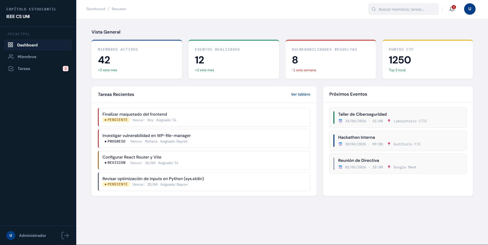
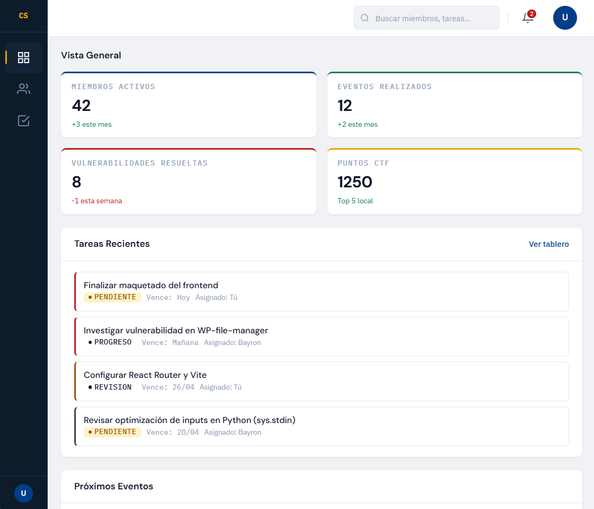
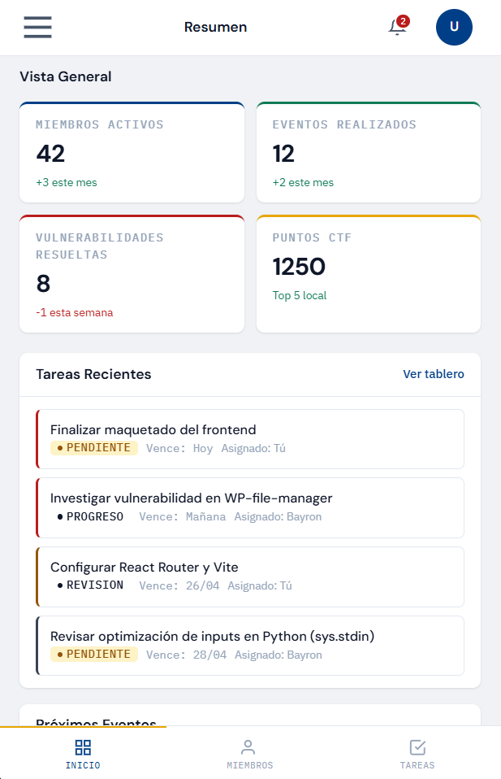

# 15 — Multi Device Dashboard

Responsive dashboard built with **HTML, CSS, and vanilla JavaScript** as part of my frontend practice projects.

## Preview

### Desktop



### Tablet



### Mobile



## Overview

This project is a multi-device dashboard for **IEEE CS UNI**, designed to adapt across desktop, tablet, and mobile screens.

It includes a responsive sidebar, topbar, dynamic stat cards, recent tasks, upcoming events, and mobile navigation.

## What I Practiced

* Rendering cards dynamically with `innerHTML`
* Using `forEach()` to generate UI from mock data
* Organizing JavaScript into `data.js`, `render.js`, and `sidebar.js`
* Building responsive layouts with `grid-template-columns`
* Using `minmax()` for flexible grid columns
* Splitting CSS into modular files
* Managing responsive behavior across mobile, tablet, and desktop

## Issues Fixed

During development, I fixed several HTML, CSS, and JavaScript issues:

* Removed duplicated script imports in the HTML
* Fixed an incorrect hamburger button ID
* Added the missing sidebar toggle logic
* Removed a visibility class that broke the mobile bottom navigation
* Hid the hamburger button on tablet to avoid unnecessary UI behavior

```css
@media (min-width: 768px) {
  .hamburger {
    display: none;
  }
}
```

## Lessons Learned

This project helped me understand that responsive design is not only about using Grid or Flexbox.

I also learned how important it is to manage breakpoints carefully, avoid conflicting utility classes, keep CSS modular, and let each component handle its own responsive behavior.
