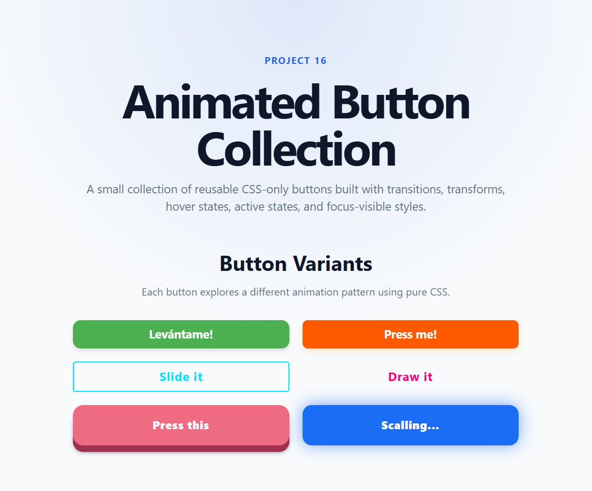

# Animated Button Collection

A small CSS-only project focused on building reusable animated buttons using transitions, transforms, pseudo-elements, and accessible interaction states.

## Preview

## What I built

This project includes a collection of animated button variants:

* Lift button
* Glow button
* Slide background button
* Border draw button
* Press button
* Scale button
* Extra experimental variants

Each button explores a different interaction pattern using only HTML and CSS.

## What I learned

I practiced smoother CSS animations using specific transition properties instead of relying on `transition: all`.

I also learned how to use:

* `transform` for lift, scale, and press effects
* `box-shadow` for glow and depth
* `::before` and `::after` for decorative animations
* `position: relative` and `z-index` to control pseudo-elements
* `overflow: hidden` for slide effects
* `:hover`, `:active`, and `:focus-visible` for better interaction states
* `cubic-bezier()` to create more dynamic and natural motion

## Bugs and fixes

One issue was using a generic selector like `.btn:hover` instead of targeting the specific button class. This caused styles to apply incorrectly.

Another bug was forgetting commas inside multi-property `transition` declarations, which broke the animation behavior.

I also learned that animating specific properties like `transform`, `box-shadow`, and `color` is cleaner and more controlled than animating everything with `all`.

## Tech Stack

* HTML
* CSS

