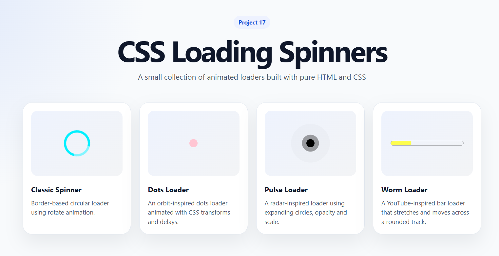

# 17 - Loading Spinners

A small collection of animated loading indicators built with pure HTML and CSS.

This project focuses on creating reusable CSS loaders while practicing `@keyframes`, animation timing, pseudo-elements, and positioning techniques.

## Preview

## Features

* Classic circular spinner
* Orbit dots loader
* Sonar pulse loader
* Worm-style progress loader
* Responsive card layout
* Pure CSS animations
* No JavaScript required

## Built With

* HTML5
* CSS3
* CSS Grid
* CSS Animations
* Pseudo-elements

## What I Learned

In this project, I practiced how to use pseudo-elements like `::before` and `::after` to create internal animated parts without adding extra HTML elements.

I also learned how to define different animation phases with `@keyframes`, and how to control them using the `animation` property with options such as duration, delay, iteration count, `linear`, `ease-in-out`, and custom `cubic-bezier()` timing functions.

Another important lesson was understanding the convenience of using `position: relative` on the parent element and `position: absolute` on internal elements, allowing loaders to move, expand, rotate, or pulse inside their own container without affecting the layout.

## Loaders

### Classic Spinner

A border-based circular loader animated with CSS rotation.

### Orbit Dots Loader

An orbit-inspired dots loader animated with CSS transforms and delays.

### Sonar Pulse Loader

A radar-inspired loader using expanding circles, opacity, and scale.

### Worm Loader

A YouTube-inspired bar loader that stretches and moves across a rounded track.

