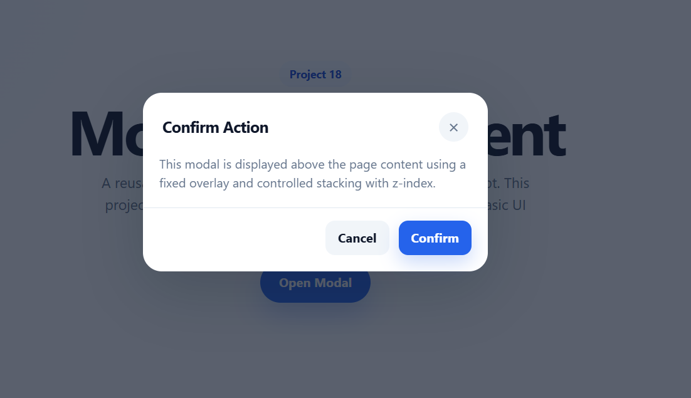

# 18 - Modal Component

A simple modal component built with HTML, CSS and JavaScript.

This project focuses on overlays, fixed positioning, z-index, accessibility attributes and basic UI interactions.

## Preview

## Features

* Open modal with a trigger button
* Close modal with the close button
* Close modal with the cancel button
* Close modal by clicking outside the modal
* Close modal with the `Escape` key
* Fixed full-screen overlay
* Smooth modal animation
* Basic accessibility using ARIA attributes

## Built With

* HTML5
* CSS3
* JavaScript
* CSS transitions
* ARIA attributes

## What I Learned

In this project, I practiced how to create a modal window that appears above the page content using `position: fixed`, an overlay layer and controlled stacking with `z-index`.

I also learned how to use ARIA attributes such as `aria-hidden`, `aria-modal`, `aria-labelledby` and `aria-describedby` to make the modal structure more meaningful and accessible.

One important mistake I made was only updating `aria-hidden` from `true` to `false`, expecting the modal to appear visually. However, `aria-hidden` only describes the accessibility state. The visual state was controlled by CSS, so I also needed to use `classList.add()` and `classList.remove()` to toggle the `.is-open` class.

This helped me understand the difference between semantic/accessibility state and visual UI state.

## Key Concepts

* `position: fixed` for full-screen overlays
* `inset: 0` to cover the entire viewport
* `z-index` for stacking layers
* `opacity`, `visibility` and `pointer-events` for hidden/visible states
* `classList` to toggle UI state
* `aria-hidden` to describe modal visibility
* Keyboard interaction with the `Escape` key