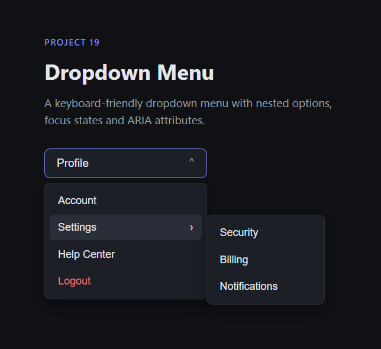

# 19 - Dropdown Menu

A keyboard-friendly dropdown menu built with HTML, CSS and JavaScript.

This project focuses on nested menus, focus states, ARIA attributes and keyboard navigation.

## Preview

## Features

* Main dropdown menu
* Nested submenu
* Open and close menu with JavaScript
* Close menu by clicking outside
* Keyboard navigation with arrow keys
* Escape key support
* Focus management for better accessibility
* ARIA attributes for expanded/collapsed states

## Built With

* HTML5
* CSS3
* JavaScript
* ARIA attributes
* CSS transitions

## What I Learned

In this project, I practiced how to build an interactive dropdown menu with a nested submenu using JavaScript and CSS state classes.

I learned how to use `aria-expanded` to communicate whether a menu or submenu is currently opened or closed. This helped me separate the visual UI state from the accessibility state.

I also practiced focus management by moving focus into the menu when it opens and returning focus to the trigger when it closes. This made the component easier to use with a keyboard.

Another important lesson was using `event.preventDefault()` before custom keyboard logic. This prevents the browser's default behavior from interfering with custom interactions such as `ArrowDown`, `ArrowUp`, `Home`, `End`, `Escape`, `ArrowRight` and `ArrowLeft`.

I also applied object destructuring in helper functions to keep the code cleaner and make optional behavior more readable, such as deciding whether a closing function should return focus to its trigger.

## Key Concepts

* `aria-expanded`
* `aria-haspopup`
* `aria-controls`
* `role="menu"`
* `role="menuitem"`
* `classList.add()`, `classList.remove()` and `classList.toggle()`
* `focus()`
* `event.preventDefault()`
* Keyboard event handling
* Object destructuring
* Click outside detection
* Nested menu state