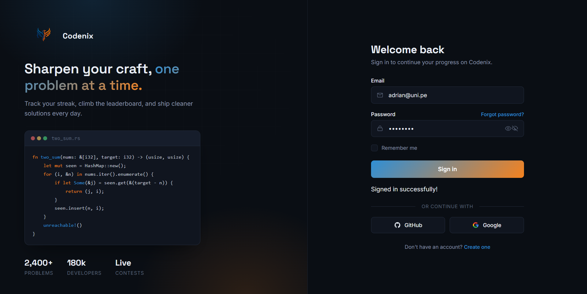
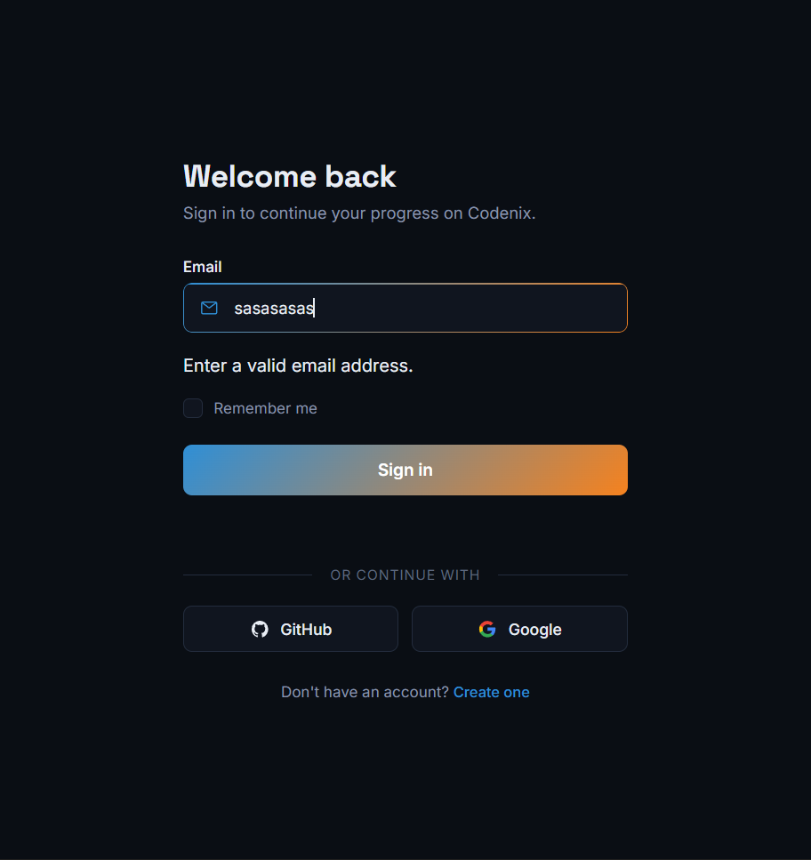

# 20 - Custom Form Elements

A custom login form UI built with HTML, CSS and JavaScript.

This project focuses on styled form elements, form states, validation feedback, password visibility, loading states and a simulated async login flow.

## Preview

## Bug Preview

## Features

* Custom styled email and password inputs
* Password visibility toggle
* Remember me checkbox
* OAuth-style buttons
* Form validation feedback
* Error and success states
* Loading state on submit
* Simulated backend request using `async` and `await`
* Responsive authentication layout
* UI concept that could later be adapted for Codenix

## Built With

* HTML5
* CSS3
* JavaScript
* Form validation
* Async/Await
* CSS form states

## What I Learned

In this project, I practiced building a polished login form UI with custom styled form elements and clear interaction states.

I used JavaScript to validate the email and password fields, show error messages, clear errors while the user is correcting the input, and manage a password visibility toggle.

I also practiced using `async` and `await` to simulate a backend login request without needing real mock data or an actual API. This helped me understand how a real form could enter a loading state, wait for a response, and then display either a success or error message.

Another important lesson was separating UI state from validation logic. The form uses classes such as `is-invalid`, `is-loading`, `is-success` and `is-error` to update the interface based on user interaction.

## Bug I Fixed

While implementing the validation messages, I found a bug where only the email error appeared and the password section disappeared.

The issue happened because I was accidentally modifying the display state of the password field/container instead of the specific `emailError` element. As a result, part of the form layout was being hidden instead of only showing the error message.

Fixing this helped me understand why error helpers should receive the exact error element they need to update, instead of modifying unrelated form containers.

## Key Concepts

* Custom form UI
* Input focus states
* Error and success states
* Password visibility toggle
* `preventDefault()` on form submit
* `async` / `await`
* Simulated backend request
* Loading state management
* DOM element targeting
* Form validation helpers

## Future Use

This UI could later be adapted as the authentication screen for Codenix, using a real backend, real OAuth providers and server-side validation.