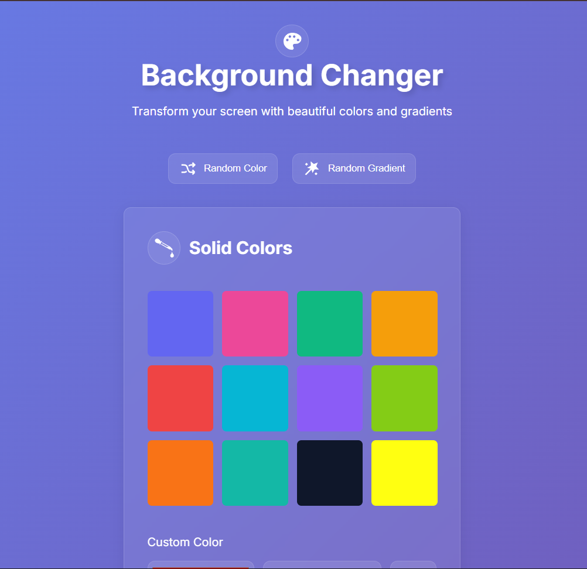
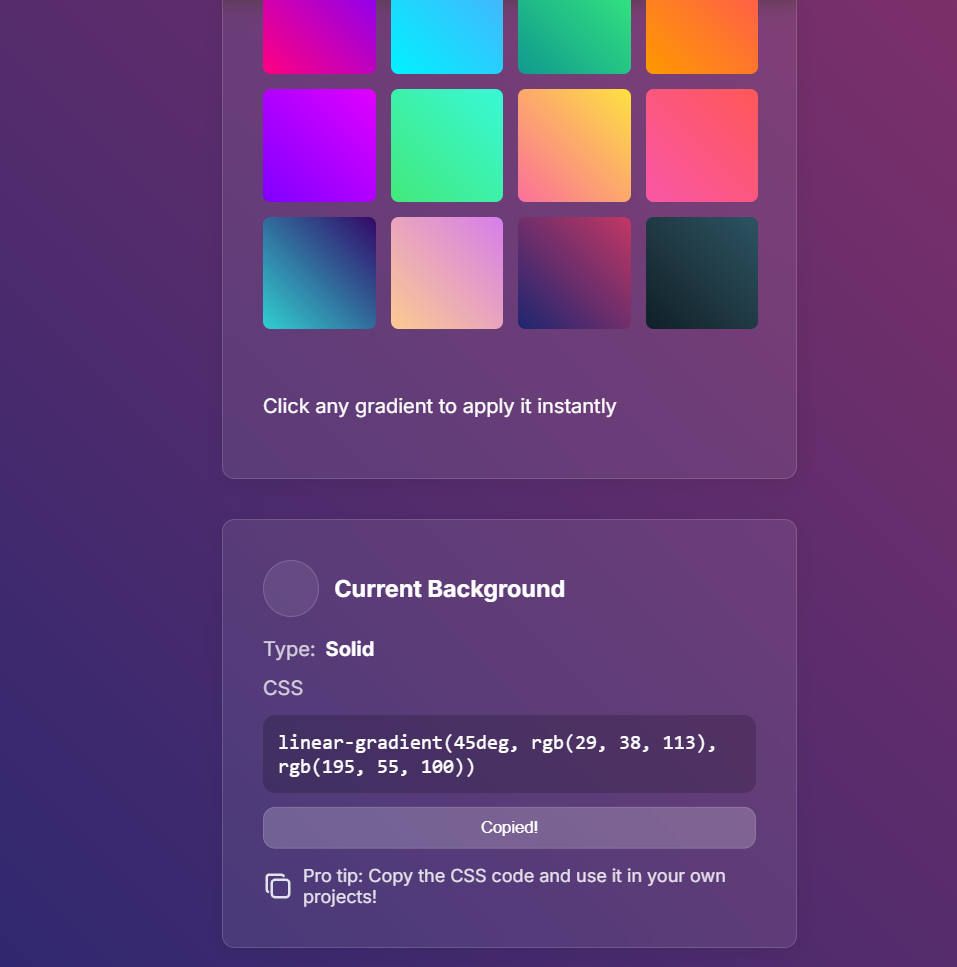

# Project 08: Background Changer & Palette Manager 🎨

A vanilla JavaScript web application that dynamically alters the screen background using solid colors, premium static gradients, random hex generators, and custom input values with strict hex code validation.

## 👁️ Interface Vistas

---

## 🕵️‍♂️ Bugs Superados & Lecciones Aprendidas

### 1. Bloqueo de Jerarquía en el Modelo de Cajas de CSS (`background` vs `background-color`)
* **El Problema:** Al usar la propiedad abreviada `.style.background` en la función de color aleatorio, el navegador inyectaba un estilo inline con una jerarquía tan alta que bloqueaba y pisaba por completo la aplicación posterior de `.style.backgroundImage` al hacer clic en los paneles de gradientes.
* **La Lección:** Ser específico en el DOM es fundamental. Se migró la lógica de color sólido a `style.backgroundColor` para liberar la propiedad de imagen y permitir que los degradados coexistieran y se renderizaran fluidamente en el body.

### 2. El Límite de `querySelector` y la Falta de Eventos
* **El Problema:** Al enlazar el listener a `.palette-grid`, el método `querySelector` capturaba únicamente la primera coincidencia en el HTML (la cuadrícula de sólidos), dejando la cuadrícula de degradados completamente aislada del script.
* **La Lección (Event Bubbling):** Se implementó **Delegación de Eventos** moviendo el listener al ancestro común `<main>`. Aprovechando el viaje de "burbujeo" de los eventos hacia arriba en el DOM y filtrando el origen con `.matches()`, logramos controlar múltiples cuadrículas con **un solo listener en memoria**, optimizando el rendimiento de la aplicación.

### 3. Sincronización de Estados con Estilos Computados
* **El Problema:** Al leer directamente las propiedades inline del body con strings vacíos, el navegador devolvía respuestas genéricas del sistema como `initial` o transparencias del tipo `rgba(0, 0, 0, 0)`.
* **La Lección:** Se utilizó `window.getComputedStyle(document.body)` acoplado a un validador que discrimina si existe un gradiente activo o un color real, garantizando que el usuario siempre vea en pantalla el código CSS exacto listo para copiar.

---

## 🛠️ Tecnologías & Optimización
* **JavaScript Asíncrono:** Uso de la API moderna `navigator.clipboard.writeText` con bloques `try...catch` para garantizar una experiencia de copiado limpia y controlada.
* **Arquitectura CSS Estática:** Renderizado inmediato de gradientes mediante pseudo-clases en CSS, reduciendo el delay de procesamiento a 0ms en el hilo principal.