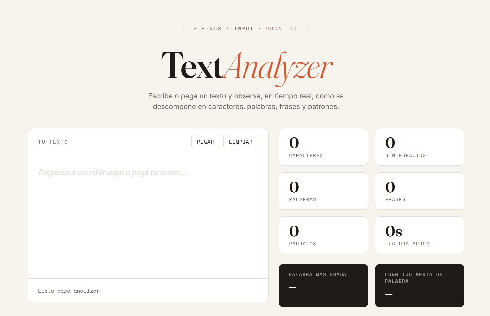
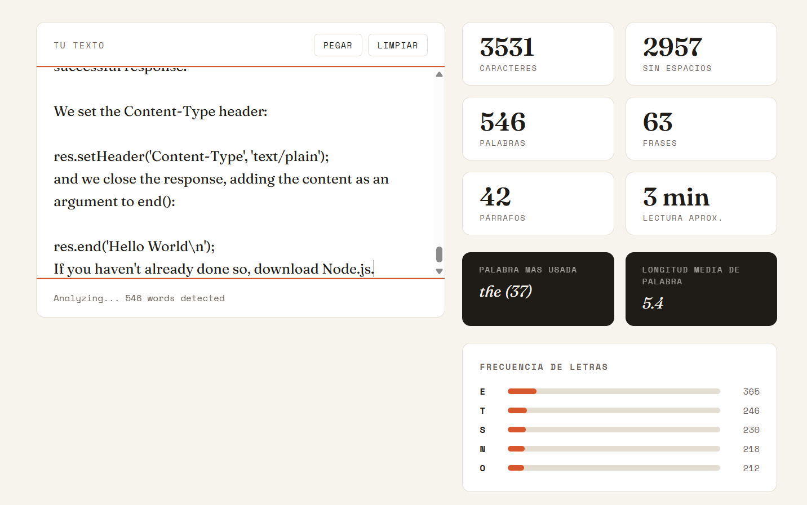

# Project 25: Text Analyzer 📊

A vanilla JavaScript web application that analyzes pasted or typed text in real time, extracting metrics such as characters, words, sentences, paragraphs, estimated reading time, most frequent word, average word length, and dynamic letter frequency bars.

## 👁️ Interface Views

---

## 🕵️‍♂️ Bugs Overcome & Lessons Learned

### 1. Regex-Based Text Parsing

* **The Problem:** Counting words, sentences, paragraphs, and letters required more than simply splitting strings by spaces. Empty text, multiple spaces, line breaks, punctuation, and mixed casing could easily produce incorrect metrics.
* **The Lesson:** Regular expressions became essential for reliable text processing. Word extraction was handled with patterns such as `match(/[a-z0-9]+/g)`, spaces were removed with `replace(/\s/g, '')`, and letter frequency was calculated from a cleaned version of the input. This improved the accuracy of the analyzer and made the logic more resilient.

### 2. Clipboard Reading with Asynchronous JavaScript

* **The Problem:** Previous projects only used clipboard writing, but this analyzer needed to read text from the user's clipboard and place it directly inside the textarea.
* **The Lesson:** The project introduced `navigator.clipboard.readText()` with `async/await` and `try...catch` blocks. After pasting the text, the app also needed to call the analyzer again and return focus to the textarea, improving the overall user experience.

### 3. Safer Dynamic Rendering Without `innerHTML`

* **The Problem:** Rendering the letter frequency table dynamically could have been done quickly with `innerHTML`, but relying too much on it can become a bad habit and may lead to XSS vulnerabilities when user-controlled content is injected into the DOM.
* **The Lesson:** The frequency rows were built using `document.createElement`, `classList.add`, `textContent`, `style.width`, and `append`. This made the rendering safer, more explicit, and easier to reason about. It also reinforced the difference between inserting text as data and injecting raw HTML.

### 4. Map, Sorting, and Dynamic Frequency Bars

* **The Problem:** Letter frequency required counting repeated characters, ranking them, and rendering only the most relevant results.
* **The Lesson:** JavaScript `Map` was used to store frequencies, then converted into an array with `entries()`, sorted by count, and sliced to display the top letters. Each bar width was calculated from the letter count relative to the total frequency, creating a clear visual representation of text patterns.

### 5. Fatigue Bugs and Naming Mistakes

* **The Problem:** Some errors came from tiredness rather than lack of understanding: typos, inconsistent variable names, calling functions incorrectly, using `for...in` instead of `for...of`, and accidentally reusing names for both DOM elements and functions.
* **The Lesson:** Working too many hours increases avoidable bugs. This project reinforced the importance of shorter focused sessions, clearer naming conventions, and reviewing code when mentally fresh.

---

## 🛠️ Technologies & Optimization

* **Vanilla JavaScript:** Real-time text analysis using DOM events and modular helper functions.
* **Clipboard API:** Asynchronous text pasting with `navigator.clipboard.readText()`.
* **Regular Expressions:** Text cleaning, word extraction, whitespace removal, and letter filtering.
* **Dynamic DOM Rendering:** Frequency bars created safely with `document.createElement` instead of `innerHTML`.
* **Data Structures:** `Map` used for word and letter frequency counting.
* **UX Improvements:** Automatic metric updates, clear button behavior, paste button support, status messages, and textarea focus management.
* **Security Awareness:** Avoided unsafe HTML injection patterns to reduce future XSS-prone habits.

---

## 📌 Final Reflection

This project looked simple at first, but it required several real frontend skills: string parsing, asynchronous browser APIs, safe DOM manipulation, dynamic rendering, and UX state updates.

The biggest lesson was that a small vanilla JavaScript project can still contain production-like concerns: correctness, security, readability, user experience, and fatigue management.
