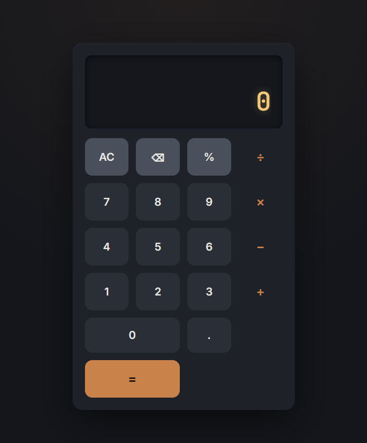
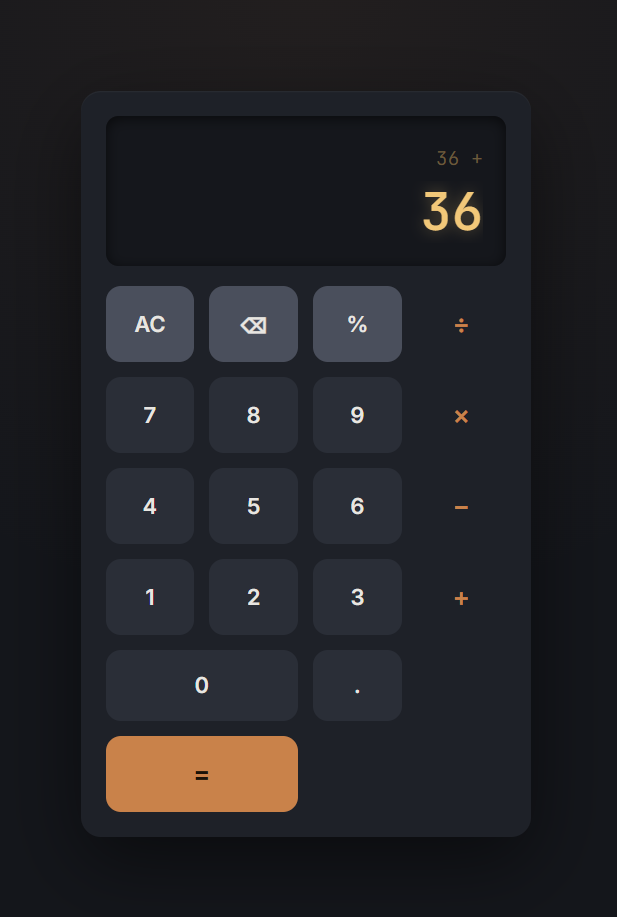

# Project 26: Calculator 🧮

A vanilla JavaScript calculator application that handles basic arithmetic operations, decimal input, percentage conversion, delete behavior, clear state, and chained calculations through a centralized state object.

## 👁️ Interface Views





---

## 🕵️‍♂️ Bugs Overcome & Lessons Learned

### 1. Event Delegation for Keypad Controls

* **The Problem:** Adding a separate event listener to every calculator button would make the code repetitive and harder to maintain.
* **The Lesson:** Event delegation was used by attaching a single click listener to the keypad container. The clicked button was detected with `.closest('.key')`, and each operation was handled through `data-action` and `data-value` attributes. This made the calculator easier to extend and kept the event logic centralized.

### 2. State-Based Operation Management

* **The Problem:** Calculator behavior depends on multiple changing values: the current display value, the previous value, the selected operator, and whether the next input should overwrite the screen.
* **The Lesson:** A centralized `state` object was used to manage the calculator flow. This made number input, decimal input, operator selection, deletion, clearing, percentage conversion, and final calculation easier to reason about.

### 3. Chained Calculations

* **The Problem:** Pressing another operator after already selecting one could produce incorrect behavior if the previous operation was not resolved first.
* **The Lesson:** Before setting a new operator, the calculator checks whether an existing operation is pending. If so, it calls `calculate()` first and then stores the new operator. This allows expressions like `5 + 3 × 2` to behave in a controlled step-by-step calculator style.

### 4. Display Overflow and Unexpected Scrollbar

* **The Problem:** Long numbers or calculation results caused an unexpected scrollbar to appear inside the result display area.
* **The Lesson:** The display was adjusted through CSS to keep the interface clean. The unwanted scrollbar was hidden using:

```css
.result::-webkit-scrollbar {
    display: none;
}
```

This improved the visual polish of the calculator and prevented the UI from looking broken when the result overflowed.

### 5. Floating-Point Precision Handling

* **The Problem:** JavaScript arithmetic can produce floating-point precision issues, such as long decimal artifacts after operations.
* **The Lesson:** Results were rounded with `Math.round(result * 1e10) / 1e10` before being converted back into strings. This kept the calculator output cleaner and more readable.

---

## 🛠️ Technologies & Optimization

* **Vanilla JavaScript:** Calculator behavior implemented without external libraries.
* **Event Delegation:** Single keypad listener using `.closest()` and dataset attributes.
* **State Management:** Centralized `state` object for current value, previous value, operator, and overwrite mode.
* **DOM Updates:** Display synchronized through a dedicated `updateDisplay()` function.
* **Arithmetic Logic:** Basic operations including addition, subtraction, multiplication, division, decimal input, delete, clear, and percentage.
* **UI Polish:** Scrollbar handling for long results and clean display feedback.
* **Error Handling:** Division by zero handled with a `"Syntax error"` display state.

---

## 📌 Final Reflection

This project reinforced how even a small calculator requires careful state management. The main challenge was not only performing arithmetic, but also controlling user input flow, display updates, overwrite behavior, chained operations, and UI edge cases.

The biggest lesson was that interactive components become easier to build when logic is separated into small functions and all actions are routed through a clear state object.
