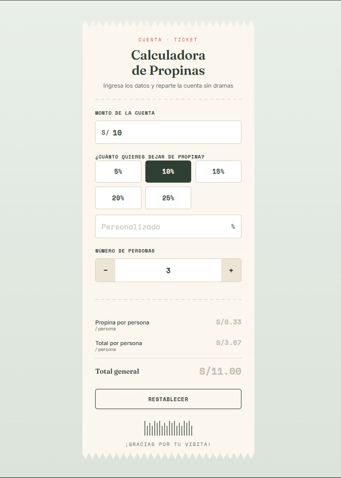

# 27 - Tip Calculator

A tip calculator UI built with HTML, CSS, and JavaScript.

This project focuses on DOM manipulation, dynamic mathematical calculations, real-time form validation, and updating the user interface based on user interactions.

## Preview

## Features

* Dynamic calculation of tip per person and grand total
* Predefined tip percentage buttons
* Custom tip input
* Controls to increase and decrease the number of people
* Real-time form validation (positive amounts, 0-100 ranges)
* Visual error states and feedback messages
* Automatic currency formatting (e.g., S/ 0.00)
* Functionality to reset the calculator to its initial state

## Built With

* HTML5
* CSS3
* JavaScript
* DOM Manipulation
* Form Validation
* CSS form states (`is-invalid`, `is-selected`, `is-invisible`)

## What I Learned

In this project, I practiced binding multiple events (`input`, `click`) to update a mathematical interface in real-time without needing to reload the page.

I learned how to extract numerical values from input elements using `parseFloat()` and `parseInt()`, as well as handling special cases like empty values or `NaN` to prevent the application from breaking.

I also improved my understanding of variable scope and types (`let` vs `const`) when incrementing or decrementing numbers. Furthermore, I reinforced the separation of state logic and the graphical interface by using classes like `is-invalid` and `is-invisible` to show or hide error messages depending on whether the validation returns `true` or `false`.

## Bug I Fixed

During development, I found a couple of interesting bugs related to JavaScript logic. 

One bug occurred in the main calculation function (`calculate()`), where I used a single vertical bar operator (`|`) instead of the logical OR operator (`||`) inside the `if` condition. This was causing bitwise operations instead of a simple logical validation.

Another bug I fixed was in the validation message logic. At first, error messages were hidden when the user made a mistake and appeared when the input was correct. This happened because I was using inverted logic when applying the `is-invisible` class (using `remove` instead of `add` in the error block). Fixing this helped me better understand the flow of conditional validations and class manipulation (`classList`).

## Key Concepts

* Custom calculation UI
* Data type conversion (`String` to `Number`)
* Logical operators (`||`)
* Variables scope (`let` vs `const`)
* Error and validation states
* NodeLists vs Individual Elements (`forEach`)
* DOM element targeting and updating
* Currency formatting

## Future Use

This mathematical and validation logic could easily be adapted for any personal finance application, shopping carts, or point-of-sale (POS) systems where splitting bills, applying discounts, and calculating percentages in real-time is required.