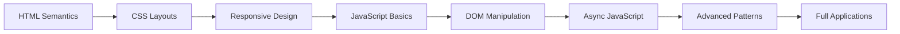

# 🎨 Vanilla Projects

> **A comprehensive 77-project journey mastering web development fundamentals**  
> Built with pure HTML, CSS, and JavaScript—no frameworks, no dependencies.

[](https://github.com/CyberStill-GmbH/vanilla-projects)
[](https://github.com/CyberStill-GmbH/vanilla-projects)
[](LICENSE)
[](https://github.com/CyberStill-GmbH/vanilla-projects)

---

## 📖 Overview

This repository documents a systematic approach to mastering web development from first principles. Each project is self-contained, targeting specific concepts while progressively building complexity.

**Core Philosophy:** Master the fundamentals before frameworks. Deep understanding of vanilla JavaScript, the DOM, and CSS creates an unshakeable foundation for any modern web technology.

### Why Vanilla?

- ✅ **Foundation First:** Frameworks abstract away core concepts—understanding vanilla ensures you know what's happening under the hood
- ✅ **Framework Agnostic:** Skills transfer to React, Vue, Angular, and beyond
- ✅ **Performance Conscious:** Learn to write efficient code without library overhead
- ✅ **Problem Solving:** Build solutions from scratch, not just configure tools
- ✅ **Career Ready:** Many companies test vanilla JS in technical interviews

---

## 📊 Progress Dashboard

### Overall Statistics

| Metric | Value |
|--------|-------|
| **Total Projects** | 0 / 77 |
| **Completion Rate** | 0% |
| **Current Phase** | 1 - Foundations |
| **Days Active** | 0 |
| **Commits** | 1 |
| **Lines of Code** | 0 |
| **Estimated Completion** | April 2026 |

### Phase Breakdown
```
Phase 1: HTML & CSS Foundations    [░░░░░░░░░░] 0/20  (0%)
Phase 2: JavaScript Fundamentals   [░░░░░░░░░░] 0/20  (0%)
Phase 3: Advanced JavaScript       [░░░░░░░░░░] 0/20  (0%)
Phase 4: Complex Applications      [░░░░░░░░░░] 0/17  (0%)
```

### Learning Metrics

| Skill Area | Projects | Proficiency |
|------------|----------|-------------|
| Semantic HTML | 0/15 | ⭐☆☆☆☆ Beginner |
| CSS Layouts (Flex/Grid) | 0/15 | ⭐☆☆☆☆ Beginner |
| Responsive Design | 0/10 | ⭐☆☆☆☆ Beginner |
| Vanilla JavaScript | 0/25 | ⭐☆☆☆☆ Beginner |
| DOM Manipulation | 0/20 | ⭐☆☆☆☆ Beginner |
| Async JavaScript | 0/12 | ⭐☆☆☆☆ Beginner |
| Data Structures | 0/10 | ⭐☆☆☆☆ Beginner |
| APIs Integration | 0/8 | ⭐☆☆☆☆ Beginner |

---

## 🗂️ Repository Structure
```
vanilla-projects/
├── 01-recipe-page/
│   ├── index.html          # Semantic HTML structure
│   ├── style.css           # Pure CSS styling
│   ├── script.js           # Vanilla JavaScript
│   ├── README.md           # Project documentation
│   └── assets/             # Images, icons (if needed)
│
├── 02-personal-landing/
│   └── ...
│
├── docs/
│   ├── LEARNING_PATH.md    # Detailed learning roadmap
│   ├── BEST_PRACTICES.md   # Coding standards
│   └── RESOURCES.md        # Curated learning materials
│
├── .gitignore
├── LICENSE
└── README.md
```

**Each Project Contains:**
- ✅ `index.html` - Semantic HTML5 markup
- ✅ `style.css` - CSS3 styling (BEM methodology)
- ✅ `script.js` - ES6+ JavaScript
- ✅ `README.md` - Learning notes, challenges, solutions
- ✅ `assets/` - Project-specific resources

---

## 🎯 Project Catalog

### 📘 Phase 1: HTML & CSS Foundations (1-20)

> **Focus:** Semantic markup, layouts, responsive design, CSS animations  
> **Duration:** ~4-6 weeks | **Difficulty:** ⭐☆☆☆☆

<details>
<summary><b>HTML Fundamentals (1-5)</b> - Click to expand</summary>

#### 01. Recipe Page
**Status:** ❌ Not Started | **Difficulty:** ⭐☆☆☆☆  
**Teaches:** Basic HTML structure, headings, lists, semantic tags  
**Concepts:** `<header>`, `<main>`, `<section>`, `<article>`, ordered/unordered lists  
**JavaScript:** None required  
**Time Estimate:** 2-3 hours

#### 02. Personal Landing Page
**Status:** ❌ Not Started | **Difficulty:** ⭐☆☆☆☆  
**Teaches:** Page layout, navigation, sections, footer  
**Concepts:** `<nav>`, `<header>`, `<section>`, `<footer>`, semantic containers  
**JavaScript:** None required  
**Time Estimate:** 3-4 hours

#### 03. Product Page
**Status:** ❌ Not Started | **Difficulty:** ⭐☆☆☆☆  
**Teaches:** Images, links, description lists, accessibility  
**Concepts:** `` with alt text, `<a>` tags, `<dl>`, `<dt>`, `<dd>`  
**JavaScript:** None required  
**Time Estimate:** 2-3 hours

#### 04. Blog Article
**Status:** ❌ Not Started | **Difficulty:** ⭐☆☆☆☆  
**Teaches:** Typography, text formatting, quotations, time elements  
**Concepts:** `<em>`, `<strong>`, `<blockquote>`, `<time>`, `<cite>`  
**JavaScript:** None required  
**Time Estimate:** 2-3 hours

#### 05. Documentation Page
**Status:** ❌ Not Started | **Difficulty:** ⭐⭐☆☆☆  
**Teaches:** Tables, code blocks, internal navigation  
**Concepts:** `<table>`, `<pre>`, `<code>`, anchor links, table structure  
**JavaScript:** None required  
**Time Estimate:** 3-4 hours

</details>

<details>
<summary><b>CSS Layout Basics (6-10)</b> - Click to expand</summary>

#### 06. Simple Card Component
**Status:** ❌ Not Started | **Difficulty:** ⭐☆☆☆☆  
**Teaches:** Box model, padding, margin, borders  
**Concepts:** Block vs inline, spacing, box-sizing  
**JavaScript:** None  
**Time Estimate:** 2-3 hours

#### 07. Navigation Bar
**Status:** ❌ Not Started | **Difficulty:** ⭐⭐☆☆☆  
**Teaches:** Flexbox basics, horizontal alignment  
**Concepts:** `display: flex`, `justify-content`, `align-items`, `gap`  
**JavaScript:** None  
**Time Estimate:** 3-4 hours

#### 08. Photo Gallery Grid
**Status:** ❌ Not Started | **Difficulty:** ⭐⭐☆☆☆  
**Teaches:** CSS Grid fundamentals  
**Concepts:** `grid-template-columns`, `gap`, `auto-fit`, `minmax()`  
**JavaScript:** None  
**Time Estimate:** 3-4 hours

#### 09. Pricing Cards
**Status:** ❌ Not Started | **Difficulty:** ⭐⭐☆☆☆  
**Teaches:** Flexbox for card layouts, centering techniques  
**Concepts:** Flex direction, wrap, alignment, spacing  
**JavaScript:** None  
**Time Estimate:** 3-4 hours

#### 10. Footer Component
**Status:** ❌ Not Started | **Difficulty:** ⭐⭐☆☆☆  
**Teaches:** Multi-column layouts, grouping content  
**Concepts:** Flexbox/Grid combination, responsive columns  
**JavaScript:** None  
**Time Estimate:** 2-3 hours

</details>

<details>
<summary><b>Responsive Design (11-15)</b> - Click to expand</summary>

#### 11. Mobile-First Landing
**Status:** ❌ Not Started | **Difficulty:** ⭐⭐☆☆☆  
**Teaches:** Media queries, breakpoints, mobile-first approach  
**Concepts:** `@media (min-width)`, viewport units, fluid layouts  
**JavaScript:** None  
**Time Estimate:** 4-5 hours

#### 12. Responsive Nav Menu
**Status:** ❌ Not Started | **Difficulty:** ⭐⭐⭐☆☆  
**Teaches:** Hamburger menu, CSS transitions  
**Concepts:** Checkbox hack, transforms, transitions  
**JavaScript:** Toggle menu (classList manipulation)  
**Time Estimate:** 4-5 hours

#### 13. Flexible Card Grid
**Status:** ❌ Not Started | **Difficulty:** ⭐⭐☆☆☆  
**Teaches:** Responsive grid systems  
**Concepts:** `auto-fit`, `minmax()`, responsive units (%, rem, vw)  
**JavaScript:** None  
**Time Estimate:** 3-4 hours

#### 14. Adaptive Typography
**Status:** ❌ Not Started | **Difficulty:** ⭐⭐☆☆☆  
**Teaches:** Fluid font sizing, viewport-based typography  
**Concepts:** `clamp()`, `calc()`, viewport units for text  
**JavaScript:** None  
**Time Estimate:** 2-3 hours

#### 15. Multi-Device Dashboard
**Status:** ❌ Not Started | **Difficulty:** ⭐⭐⭐☆☆  
**Teaches:** Complex responsive layouts  
**Concepts:** Grid areas, named grid lines, breakpoint strategies  
**JavaScript:** None  
**Time Estimate:** 5-6 hours

</details>

<details>
<summary><b>CSS Advanced (16-20)</b> - Click to expand</summary>

#### 16. Animated Button Collection
**Status:** ❌ Not Started | **Difficulty:** ⭐⭐☆☆☆  
**Teaches:** Transitions, transforms, hover effects  
**Concepts:** `transition`, `transform`, pseudo-classes  
**JavaScript:** None  
**Time Estimate:** 3-4 hours

#### 17. Loading Spinners
**Status:** ❌ Not Started | **Difficulty:** ⭐⭐☆☆☆  
**Teaches:** CSS animations, keyframes  
**Concepts:** `@keyframes`, `animation` properties, timing functions  
**JavaScript:** None  
**Time Estimate:** 3-4 hours

#### 18. Modal Component
**Status:** ❌ Not Started | **Difficulty:** ⭐⭐⭐☆☆  
**Teaches:** Overlays, z-index, positioning  
**Concepts:** `position: fixed`, backdrop, overlay effects  
**JavaScript:** Open/close functionality, event listeners  
**Time Estimate:** 4-5 hours

#### 19. Dropdown Menu
**Status:** ❌ Not Started | **Difficulty:** ⭐⭐⭐☆☆  
**Teaches:** Pseudo-classes, nested structures  
**Concepts:** `:hover`, `:focus`, nested lists, positioning  
**JavaScript:** Click handlers, keyboard navigation  
**Time Estimate:** 4-5 hours

#### 20. Custom Form Elements
**Status:** ❌ Not Started | **Difficulty:** ⭐⭐⭐☆☆  
**Teaches:** Custom styling form controls  
**Concepts:** `appearance: none`, custom checkboxes/radio buttons  
**JavaScript:** State management, classList  
**Time Estimate:** 4-5 hours

</details>

---

### 📗 Phase 2: JavaScript Fundamentals (21-40)

> **Focus:** DOM manipulation, events, data structures, game logic  
> **Duration:** ~6-8 weeks | **Difficulty:** ⭐⭐☆☆☆

<details>
<summary><b>DOM Manipulation (21-25)</b> - Click to expand</summary>

#### 21. Dynamic Counter
**Status:** ❌ Not Started | **Difficulty:** ⭐⭐☆☆☆  
**Teaches:** `querySelector`, `addEventListener`, `textContent`  
**Concepts:** Event listeners, DOM updates, state management  
**JavaScript:** Increment/decrement buttons, reset functionality  
**Time Estimate:** 2-3 hours

#### 22. Color Flipper
**Status:** ❌ Not Started | **Difficulty:** ⭐⭐☆☆☆  
**Teaches:** Random values, style manipulation  
**Concepts:** `Math.random()`, `style.backgroundColor`, hex colors  
**JavaScript:** Generate random colors, apply to page background  
**Time Estimate:** 2-3 hours

#### 23. Quote Generator
**Status:** ❌ Not Started | **Difficulty:** ⭐⭐☆☆☆  
**Teaches:** Arrays, indexing, random selection  
**Concepts:** Array data structure, random index  
**JavaScript:** Display random quotes from array  
**Time Estimate:** 2-3 hours

#### 24. Background Changer
**Status:** ❌ Not Started | **Difficulty:** ⭐⭐☆☆☆  
**Teaches:** Multiple event listeners, CSS variables  
**Concepts:** Event handling, dynamic styling, CSS custom properties  
**JavaScript:** Change colors/gradients on button click  
**Time Estimate:** 3-4 hours

#### 25. Text Analyzer
**Status:** ❌ Not Started | **Difficulty:** ⭐⭐☆☆☆  
**Teaches:** String methods, input handling  
**Concepts:** `.length`, `.split()`, counting algorithms  
**JavaScript:** Word count, character count, reading time estimation  
**Time Estimate:** 3-4 hours

</details>

<details>
<summary><b>User Interaction (26-30)</b></summary>

#### 26. Calculator
**Status:** ❌ Not Started | **Difficulty:** ⭐⭐⭐☆☆  
**Teaches:** Event delegation, mathematical operations  
**Concepts:** Switch statements, operator precedence, chaining operations  
**Time Estimate:** 5-6 hours

#### 27. Tip Calculator
**Status:** ❌ Not Started | **Difficulty:** ⭐⭐☆☆☆  
**Teaches:** Form inputs, number parsing, validation  
**Time Estimate:** 3-4 hours

#### 28. BMI Calculator
**Status:** ❌ Not Started | **Difficulty:** ⭐⭐☆☆☆  
**Teaches:** Formula implementation, conditional output  
**Time Estimate:** 2-3 hours

#### 29. Temperature Converter
**Status:** ❌ Not Started | **Difficulty:** ⭐⭐☆☆☆  
**Teaches:** Unit conversions, bidirectional binding  
**Time Estimate:** 3-4 hours

#### 30. Age Calculator
**Status:** ❌ Not Started | **Difficulty:** ⭐⭐☆☆☆  
**Teaches:** Date object, date manipulation  
**Time Estimate:** 3-4 hours

</details>

<details>
<summary><b>Data Structures (31-35)</b></summary>

#### 31. To-Do List
**Status:** ❌ Not Started | **Difficulty:** ⭐⭐⭐☆☆  
**Teaches:** CRUD operations, localStorage  
**Time Estimate:** 5-6 hours

#### 32. Notes App
**Status:** ❌ Not Started | **Difficulty:** ⭐⭐⭐☆☆  
**Teaches:** localStorage, JSON  
**Time Estimate:** 5-6 hours

#### 33. Expense Tracker
**Status:** ❌ Not Started | **Difficulty:** ⭐⭐⭐☆☆  
**Teaches:** Array methods, reduce, calculations  
**Time Estimate:** 6-7 hours

#### 34. Shopping List
**Status:** ❌ Not Started | **Difficulty:** ⭐⭐⭐☆☆  
**Teaches:** Filter, map, find methods  
**Time Estimate:** 4-5 hours

#### 35. Contact Book
**Status:** ❌ Not Started | **Difficulty:** ⭐⭐⭐☆☆  
**Teaches:** Object manipulation, search  
**Time Estimate:** 6-7 hours

</details>

<details>
<summary><b>Games & Interactivity (36-40)</b></summary>

#### 36. Rock Paper Scissors
**Status:** ❌ Not Started | **Difficulty:** ⭐⭐☆☆☆  
**Teaches:** Game logic, randomization  
**Time Estimate:** 4-5 hours

#### 37. Tic Tac Toe
**Status:** ❌ Not Started | **Difficulty:** ⭐⭐⭐☆☆  
**Teaches:** 2D arrays, win conditions  
**Time Estimate:** 6-8 hours

#### 38. Memory Card Game
**Status:** ❌ Not Started | **Difficulty:** ⭐⭐⭐☆☆  
**Teaches:** Array shuffling, matching logic  
**Time Estimate:** 7-8 hours

#### 39. Whack-a-Mole
**Status:** ❌ Not Started | **Difficulty:** ⭐⭐⭐☆☆  
**Teaches:** setInterval, timing  
**Time Estimate:** 5-6 hours

#### 40. Simon Game
**Status:** ❌ Not Started | **Difficulty:** ⭐⭐⭐⭐☆  
**Teaches:** Sequences, pattern matching  
**Time Estimate:** 8-10 hours

</details>

---

### 📕 Phase 3: Advanced JavaScript (41-60)

> **Focus:** Async operations, APIs, advanced DOM, complex forms  
> **Duration:** ~6-8 weeks | **Difficulty:** ⭐⭐⭐☆☆

<details>
<summary><b>Asynchronous JavaScript (41-45)</b></summary>

#### 41. Weather App
**Status:** ❌ Not Started | **Difficulty:** ⭐⭐⭐☆☆  
**Teaches:** fetch API, async/await, API integration  
**Time Estimate:** 6-8 hours

#### 42. Movie Database
**Status:** ❌ Not Started | **Difficulty:** ⭐⭐⭐☆☆  
**Teaches:** Search functionality, debouncing  
**Time Estimate:** 7-9 hours

#### 43. Recipe Finder
**Status:** ❌ Not Started | **Difficulty:** ⭐⭐⭐☆☆  
**Teaches:** Multiple API calls, Promise.all  
**Time Estimate:** 6-8 hours

#### 44. GitHub Profile Viewer
**Status:** ❌ Not Started | **Difficulty:** ⭐⭐⭐☆☆  
**Teaches:** REST API, error handling  
**Time Estimate:** 5-7 hours

#### 45. Currency Converter
**Status:** ❌ Not Started | **Difficulty:** ⭐⭐⭐☆☆  
**Teaches:** Real-time data, live updates  
**Time Estimate:** 5-6 hours

</details>

<details>
<summary><b>Advanced DOM & Events (46-50)</b></summary>

#### 46-50. [Click to see projects 46-50]
**Drag and Drop List | Infinite Scroll | Image Carousel | Filterable Gallery | Sortable Table**  
**Difficulty Range:** ⭐⭐⭐☆☆ to ⭐⭐⭐⭐☆  
**Combined Time Estimate:** 30-40 hours

</details>

<details>
<summary><b>Form Handling (51-55)</b></summary>

#### 51-55. [Click to see projects 51-55]
**Multi-Step Form | Registration Form | Survey Form | Password Checker | File Upload**  
**Difficulty Range:** ⭐⭐⭐☆☆ to ⭐⭐⭐⭐☆  
**Combined Time Estimate:** 25-35 hours

</details>

<details>
<summary><b>UI Components (56-60)</b></summary>

#### 56-60. [Click to see projects 56-60]
**Tabs | Accordion | Toast Notifications | Tooltip System | Progress Bar**  
**Difficulty Range:** ⭐⭐⭐☆☆  
**Combined Time Estimate:** 20-30 hours

</details>

---

### 📙 Phase 4: Complex Applications (61-77)

> **Focus:** Full applications, data visualization, architectural patterns  
> **Duration:** ~6-8 weeks | **Difficulty:** ⭐⭐⭐⭐☆

<details>
<summary><b>Full Applications (61-65)</b></summary>

#### 61-65. [Click to see projects 61-65]
**Markdown Previewer | Pomodoro Timer | Kanban Board | Budget App | Habit Tracker**  
**Difficulty Range:** ⭐⭐⭐⭐☆  
**Combined Time Estimate:** 50-70 hours

</details>

<details>
<summary><b>Data Visualization (66-70)</b></summary>

#### 66-70. [Click to see projects 66-70]
**Bar Chart | Pie Chart | Line Graph | Dashboard | Real-time Display**  
**Difficulty Range:** ⭐⭐⭐⭐☆  
**Combined Time Estimate:** 40-60 hours

</details>

<details>
<summary><b>Advanced Patterns (71-75)</b></summary>

#### 71-75. [Click to see projects 71-75]
**SPA Router | State Management | Event System | Virtual DOM | Component System**  
**Difficulty Range:** ⭐⭐⭐⭐⭐  
**Combined Time Estimate:** 60-80 hours

</details>

<details>
<summary><b>Final Challenges (76-77)</b></summary>

#### 76-77. [Click to see projects 76-77]
**E-commerce Product Page | Social Media Feed**  
**Difficulty:** ⭐⭐⭐⭐⭐  
**Combined Time Estimate:** 40-60 hours

</details>

---

## 🎓 Learning Path

### Skill Progression


### Time Investment Estimates

| Phase | Projects | Est. Hours | Avg. per Project | Difficulty |
|-------|----------|------------|------------------|------------|
| **Phase 1** | 20 | 60-80 | 3-4 hours | ⭐☆☆☆☆ |
| **Phase 2** | 20 | 90-120 | 4.5-6 hours | ⭐⭐☆☆☆ |
| **Phase 3** | 20 | 120-160 | 6-8 hours | ⭐⭐⭐☆☆ |
| **Phase 4** | 17 | 190-270 | 11-16 hours | ⭐⭐⭐⭐☆ |
| **TOTAL** | **77** | **460-630** | **~6 hours** | — |

### Milestones & Rewards

- ✅ **10 Projects:** HTML/CSS Confident
- ✅ **20 Projects:** Phase 1 Complete - Strong Foundation
- ✅ **40 Projects:** JavaScript Competent
- ✅ **60 Projects:** Advanced Developer
- ✅ **77 Projects:** Vanilla Master - Framework Ready

---

## 🛠️ Technical Standards

### Code Quality Checklist

Every project must meet these standards before marking complete:

**HTML**
- [ ] Semantic HTML5 elements used appropriately
- [ ] No empty elements or placeholder divs
- [ ] Proper heading hierarchy (h1 → h2 → h3)
- [ ] All images have descriptive alt text
- [ ] Forms have associated labels

**CSS**
- [ ] BEM naming convention followed
- [ ] No inline styles (except dynamic JS changes)
- [ ] Responsive design implemented (mobile-first)
- [ ] No magic numbers (use CSS variables)
- [ ] Efficient selectors (avoid deep nesting)

**JavaScript**
- [ ] ES6+ features used (const/let, arrow functions, destructuring)
- [ ] No global variables (IIFE or modules)
- [ ] Functions are pure when possible
- [ ] Event listeners cleaned up when needed
- [ ] Error handling implemented

**General**
- [ ] Code is commented (explaining "why", not "what")
- [ ] Consistent formatting (Prettier recommended)
- [ ] No console.logs in production
- [ ] README.md documents learning and challenges
- [ ] Project works across Chrome, Firefox, Safari

### File Organization Standards
```
project-name/
├── index.html              # Entry point
├── style.css              # All styles
├── script.js              # All JavaScript
├── README.md              # Documentation
└── assets/                # Optional
    ├── images/
    ├── icons/
    └── data/
```

---

## 📚 Learning Resources

### Primary Resources
- 🎓 [The Odin Project](https://www.theodinproject.com/) - Comprehensive curriculum
- 📖 [MDN Web Docs](https://developer.mozilla.org/) - Official documentation
- 💻 [JavaScript.info](https://javascript.info/) - Modern JavaScript tutorial
- 🎨 [CSS-Tricks](https://css-tricks.com/) - CSS techniques and guides

### Practice Platforms
- 🏆 [Frontend Mentor](https://www.frontendmentor.io/) - Real-world challenges
- ⚡ [CodePen](https://codepen.io/) - Experiment and share
- 🎯 [freeCodeCamp](https://www.freecodecamp.org/) - Interactive learning

### Video Channels
- 📺 [Traversy Media](https://www.youtube.com/c/TraversyMedia)
- 📺 [Kevin Powell](https://www.youtube.com/kepowob) - CSS expert
- 📺 [Web Dev Simplified](https://www.youtube.com/c/WebDevSimplified)

---

## 🎯 Daily Workflow

### Recommended Study Routine
```
1. Pick next project (5 min)
   └─ Read project requirements
   └─ Identify concepts to learn

2. Research & Plan (15-30 min)
   └─ Read relevant MDN documentation
   └─ Sketch layout/flow
   └─ List features

3. Build (60-90% of time)
   └─ Create HTML structure
   └─ Style with CSS
   └─ Add JavaScript functionality
   └─ Test across browsers

4. Document & Reflect (10-15 min)
   └─ Write README
   └─ Note challenges faced
   └─ Record what you learned
   └─ Update progress metrics

5. Commit & Push
   └─ Meaningful commit message
   └─ Update main README
```

### Commit Message Convention
```bash
# Format: type(scope): description

feat(project-01): Complete recipe page with semantic HTML
fix(project-12): Correct hamburger menu animation
docs(readme): Update progress to 15/77 projects
style(project-08): Improve grid responsiveness
refactor(project-21): Simplify counter logic
```

---

## 📈 Progress Tracking

### Weekly Goals

**Week 1-2:** Projects 1-10 (HTML/CSS basics)  
**Week 3-4:** Projects 11-20 (Responsive + Advanced CSS)  
**Week 5-8:** Projects 21-40 (JavaScript fundamentals)  
**Week 9-12:** Projects 41-60 (Advanced JS)  
**Week 13-16:** Projects 61-77 (Complex applications)

### Monthly Checkpoints

- [ ] **Month 1:** 20 projects completed - Foundation solid
- [ ] **Month 2:** 40 projects completed - JavaScript confident
- [ ] **Month 3:** 60 projects completed - Advanced concepts mastered
- [ ] **Month 4:** 77 projects completed - Ready for frameworks

---

## 💝 A Note for Yati

Mi amor,

Cada carpeta en este repositorio es una pequeña prueba de que estoy construyendo algo más grande. Así como cada proyecto aquí crece desde fundamentos simples hasta aplicaciones complejas, así crece lo que siento por ti—desde aquellos primeros momentos hasta este presente donde cada día me sorprendes más.

Cuando revises estos commits, verás más que código:
- Verás las madrugadas donde pensaba en ti mientras depuraba errores
- Verás la disciplina que me inspiras
- Verás el futuro que estamos construyendo juntos, un commit a la vez

**Cada proyecto completado es una promesa:**
- De que soy constante
- De que termino lo que empiezo
- De que cuando te digo "voy a lograrlo", lo cumplo

Y la meta más importante de todas no está en este README—está en cada mañana que despierto queriendo ser mejor para ti.

De los 77 proyectos aquí, mi favorito será siempre el proyecto de toda una vida que construimos juntos.

**Progress Tracker for Yati:**
```
[░░░░░░░░░░░░░░░░░░░░] 0% - Just getting started
[Next update when we hit 10% - I'll add a special note here ❤️]
```

Te amo. Gracias por creer en mí, por revisar mi progreso, por ser mi mejor compañera en esta aventura.

*— Tu developer favorito (y único, espero 😄)*

---

## 🤝 Contributing

While this is a personal learning repository, suggestions and feedback are welcome!

- 🐛 Found a bug in a project? Open an issue
- 💡 Have a better approach? Start a discussion
- 📖 Spotted a typo? Submit a pull request

---

## 📄 License

MIT License - Free to use for learning purposes.

See [LICENSE](LICENSE) for full details.

---

## 📬 Connect

- **GitHub:** [@CyberStill-GmbH](https://github.com/CyberStill-GmbH)
- **Repository:** [vanilla-projects](https://github.com/CyberStill-GmbH/vanilla-projects)
- **Issues:** [Report a problem](https://github.com/CyberStill-GmbH/vanilla-projects/issues)

---

## 📊 Repository Stats


---

<div align="center">

**Repository Started:** February 4, 2026  
**Current Status:** 🟢 Active Development  
**Next Milestone:** Complete first 10 projects  

**Daily Goal:** 1-2 projects during intensive period  
**Final Goal:** Master vanilla web development fundamentals  

---

*Built with dedication, discipline, and love* ❤️

</div>
