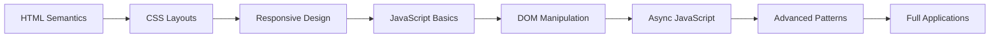

# 🎨 Vanilla Projects

> **A 77-project journey to master web development fundamentals**  
> Built with pure HTML, CSS, and JavaScript — no frameworks, no dependencies.

[](https://github.com/CyberStill-GmbH/vanilla-projects)
[](https://github.com/CyberStill-GmbH/vanilla-projects)
[](https://github.com/CyberStill-GmbH/vanilla-projects)
[](LICENSE)

---

## 📖 Overview

This repository documents a structured path for mastering web development from first principles. Every project is self-contained and focuses on a specific concept: semantic HTML, responsive layouts, CSS architecture, DOM manipulation, events, reusable JavaScript patterns, and eventually full browser applications.

**Core idea:** master the fundamentals before leaning on frameworks. A strong vanilla foundation makes React, Vue, Angular, Svelte, and backend-rendered interfaces easier to understand because the browser stops feeling like magic.

### Why Vanilla?

- ✅ **Foundation first:** understand what frameworks abstract away.
- ✅ **Framework agnostic:** the skills transfer to any frontend stack.
- ✅ **Performance aware:** learn how much can be done without dependencies.
- ✅ **Problem-solving focused:** build behavior from scratch instead of only configuring libraries.
- ✅ **Interview useful:** many technical interviews still test HTML, CSS, DOM, and vanilla JavaScript.

---

## 📊 Progress Dashboard

### Overall Statistics

| Metric | Value |
|--------|-------|
| **Total Projects** | 19 / 77 |
| **Completion Rate** | 24.7% |
| **Current Focus** | Responsive CSS + DOM fundamentals |
| **Completed Ranges** | 01-15, 21-24 |
| **Latest Project** | 15. Multi-Device Dashboard |
| **Deployment** | GitHub Pages |
| **Repository Status** | Active development |

### Phase Breakdown

```text
Phase 1: HTML & CSS Foundations    [███████░░░] 15/20 (75%)
Phase 2: JavaScript Fundamentals   [██░░░░░░░░]  4/20 (20%)
Phase 3: Advanced JavaScript       [░░░░░░░░░░]  0/20 (0%)
Phase 4: Complex Applications      [░░░░░░░░░░]  0/17 (0%)
```

### Learning Metrics

| Skill Area | Progress | Current Level |
|------------|----------|---------------|
| Semantic HTML | 15/15 | ⭐⭐⭐⭐☆ Strong foundation |
| CSS Layouts | 15/15 | ⭐⭐⭐⭐☆ Strong foundation |
| Responsive Design | 5/10 | ⭐⭐⭐☆☆ Improving |
| CSS Grid / Flexbox | 10/15 | ⭐⭐⭐☆☆ Improving |
| Vanilla JavaScript | 4/25 | ⭐⭐☆☆☆ Building consistency |
| DOM Manipulation | 4/20 | ⭐⭐☆☆☆ Building consistency |
| Async JavaScript | 0/12 | ⭐☆☆☆☆ Not started |
| APIs Integration | 0/8 | ⭐☆☆☆☆ Not started |

---

## 🧩 Recently Fixed Bugs

This repository is also a record of real debugging practice, not just finished UI screenshots.

| Area | Bug / Issue | Fix |
|------|-------------|-----|
| Responsive navigation | Hamburger menu appeared where it was not needed on tablet layouts. | Added the correct tablet breakpoint behavior and hid the hamburger with `.hamburger { display: none; }` where appropriate. |
| Mobile menu behavior | Menu state could remain visually inconsistent after viewport changes or link clicks. | Improved open/close logic with class toggling, link-click closing, and outside-click handling. |
| HTML structure | A misplaced or overlapping HTML section affected layout behavior. | Cleaned the document structure so sections render in the expected order. |
| Dynamic rendering | Repeated card markup made updates harder to maintain. | Used JavaScript data arrays with `forEach()` and `innerHTML` to generate cards dynamically. |
| Responsive dashboard | Cards needed to adapt cleanly across desktop, tablet, and mobile. | Used `grid-template-columns`, `minmax()`, and responsive breakpoints for a stable multi-device layout. |

---

## 🗂️ Repository Structure

```text
vanilla-projects/
├── 01-recipe-page/
│   ├── index.html
│   ├── style.css
│   ├── script.js
│   ├── README.md
│   └── assets/
│
├── 15-multi-device-dashboard/
│   ├── index.html
│   ├── style.css
│   ├── script.js
│   ├── README.md
│   └── assets/
│
├── docs/
│   ├── LEARNING_PATH.md
│   ├── BEST_PRACTICES.md
│   └── RESOURCES.md
│
├── .gitignore
├── LICENSE
└── README.md
```

Each project follows the same basic structure: semantic HTML, pure CSS, vanilla JavaScript, project-specific assets, and a short README explaining what was built and what was learned.

---

## 🎯 Project Catalog

### 📘 Phase 1: HTML & CSS Foundations (01-20)

| # | Project | Status | Main Focus |
|---|---------|--------|------------|
| 01 | Recipe Page | ✅ Completed | Semantic HTML, lists, basic structure |
| 02 | Personal Landing Page | ✅ Completed | Page sections, navigation, layout |
| 03 | Product Page | ✅ Completed | Images, links, accessibility |
| 04 | Blog Article | ✅ Completed | Typography, article structure |
| 05 | Documentation Page | ✅ Completed | Tables, code blocks, internal navigation |
| 06 | Simple Card Component | ✅ Completed | Box model, spacing, borders |
| 07 | Navigation Bar | ✅ Completed | Flexbox alignment |
| 08 | Photo Gallery Grid | ✅ Completed | CSS Grid, `auto-fit`, `minmax()` |
| 09 | Pricing Cards | ✅ Completed | Card layouts, responsive spacing |
| 10 | Footer Component | ✅ Completed | Multi-column footer layout |
| 11 | Mobile-First Landing | ✅ Completed | Mobile-first responsive design |
| 12 | Responsive Nav Menu | ✅ Completed | Hamburger menu, transitions, JS toggle |
| 13 | Flexible Card Grid | ✅ Completed | Responsive grid systems |
| 14 | Adaptive Typography | ✅ Completed | `clamp()`, fluid text sizing |
| 15 | Multi-Device Dashboard | ✅ Completed | Dashboard layout across desktop, tablet, and mobile |
| 16 | Animated Button Collection | ⏳ Not Started | Transitions, transforms, hover states |
| 17 | Loading Spinners | ⏳ Not Started | Keyframes, animation timing |
| 18 | Modal Component | ⏳ Not Started | Overlays, z-index, fixed positioning |
| 19 | Dropdown Menu | ⏳ Not Started | Nested menus, focus states |
| 20 | Custom Form Elements | ⏳ Not Started | Styled inputs, form states |

### 📗 Phase 2: JavaScript Fundamentals (21-40)

| # | Project | Status | Main Focus |
|---|---------|--------|------------|
| 21 | Dynamic Counter | ✅ Completed | Events, state, DOM updates |
| 22 | Color Flipper | ✅ Completed | Random values, style manipulation |
| 23 | Quote Generator | ✅ Completed | Arrays, random selection |
| 24 | Background Changer | ✅ Completed | Events, CSS variables, dynamic styles |
| 25 | Text Analyzer | ⏳ Not Started | Strings, input handling, counting |
| 26 | Calculator | ⏳ Not Started | Event delegation, operations |
| 27 | Tip Calculator | ⏳ Not Started | Forms, parsing, validation |
| 28 | BMI Calculator | ⏳ Not Started | Formula implementation |
| 29 | Temperature Converter | ⏳ Not Started | Unit conversion, input sync |
| 30 | Age Calculator | ⏳ Not Started | Date handling |
| 31 | To-Do List | ⏳ Not Started | CRUD, localStorage |
| 32 | Notes App | ⏳ Not Started | JSON, persistence |
| 33 | Expense Tracker | ⏳ Not Started | Array methods, calculations |
| 34 | Shopping List | ⏳ Not Started | `filter`, `map`, `find` |
| 35 | Contact Book | ⏳ Not Started | Objects, search, filtering |
| 36 | Rock Paper Scissors | ⏳ Not Started | Game logic |
| 37 | Tic Tac Toe | ⏳ Not Started | 2D state, win conditions |
| 38 | Memory Card Game | ⏳ Not Started | Matching logic, shuffling |
| 39 | Whack-a-Mole | ⏳ Not Started | Timers, interaction |
| 40 | Simon Game | ⏳ Not Started | Sequences, pattern matching |

### 📕 Phase 3: Advanced JavaScript (41-60)

| Range | Projects | Focus | Status |
|-------|----------|-------|--------|
| 41-45 | Weather App, Movie Database, Recipe Finder, GitHub Profile Viewer, Currency Converter | Async JS, APIs, `fetch`, error handling | ⏳ Not Started |
| 46-50 | Drag and Drop List, Infinite Scroll, Image Carousel, Filterable Gallery, Sortable Table | Advanced DOM and events | ⏳ Not Started |
| 51-55 | Multi-Step Form, Registration Form, Survey Form, Password Checker, File Upload | Forms and validation | ⏳ Not Started |
| 56-60 | Tabs, Accordion, Toast Notifications, Tooltip System, Progress Bar | Reusable UI components | ⏳ Not Started |

### 📙 Phase 4: Complex Applications (61-77)

| Range | Projects | Focus | Status |
|-------|----------|-------|--------|
| 61-65 | Markdown Previewer, Pomodoro Timer, Kanban Board, Budget App, Habit Tracker | Full browser apps | ⏳ Not Started |
| 66-70 | Bar Chart, Pie Chart, Line Graph, Dashboard, Real-time Display | Data visualization | ⏳ Not Started |
| 71-75 | SPA Router, State Management, Event System, Virtual DOM, Component System | Architecture patterns | ⏳ Not Started |
| 76-77 | E-commerce Product Page, Social Media Feed | Final challenges | ⏳ Not Started |

---

## 🧠 Lessons Learned So Far

- Semantic HTML makes layouts easier to style, debug, and maintain.
- CSS Grid is strong for page-level layouts, while Flexbox is better for one-dimensional alignment.
- `grid-template-columns`, `auto-fit`, and `minmax()` are essential for responsive card systems.
- Mobile-first CSS keeps breakpoints cleaner and avoids fighting the layout later.
- DOM manipulation becomes easier when the data is separated from the markup.
- `forEach()` plus template strings can reduce repeated HTML and make card generation more maintainable.
- Small UI bugs often come from state mismatch: the DOM says one thing, CSS classes say another, and the viewport changes the rules.
- Modularizing CSS and JavaScript early prevents small projects from turning into messy files.

---

## 🎓 Learning Path


```mermaid
graph LR
    A[HTML Semantics] --> B[CSS Layouts]
    B --> C[Responsive Design]
    C --> D[JavaScript Basics]
    D --> E[DOM Manipulation]
    E --> F[Async JavaScript]
    F --> G[Advanced Patterns]
    G --> H[Full Applications]
```

### Time Investment Estimates

| Phase | Projects | Estimated Hours | Average per Project | Difficulty |
|-------|----------|-----------------|---------------------|------------|
| **Phase 1** | 20 | 60-80 | 3-4 hours | ⭐☆☆☆☆ |
| **Phase 2** | 20 | 90-120 | 4.5-6 hours | ⭐⭐☆☆☆ |
| **Phase 3** | 20 | 120-160 | 6-8 hours | ⭐⭐⭐☆☆ |
| **Phase 4** | 17 | 190-270 | 11-16 hours | ⭐⭐⭐⭐☆ |
| **Total** | **77** | **460-630** | **~6 hours** | — |

---

## 🛠️ Technical Standards

### HTML

- Semantic HTML5 elements used appropriately.
- Clear heading hierarchy.
- Descriptive alt text for images.
- Labels connected to form controls.
- No unnecessary wrapper elements.

### CSS

- Mobile-first responsive design.
- CSS variables for repeated values.
- Flexbox and Grid used intentionally.
- Avoid deep selector nesting.
- Avoid magic numbers when a reusable spacing/token would be clearer.

### JavaScript

- Use `const` and `let` instead of `var`.
- Keep DOM queries clear and intentional.
- Separate data, rendering, and event handling when possible.
- Use readable functions with a single responsibility.
- Handle invalid user input when forms are involved.

---

## 🎯 Daily Workflow

```text
1. Pick the next project
   └─ Read the requirements
   └─ Identify the main concept

2. Plan before coding
   └─ Sketch the structure
   └─ Define the layout
   └─ List the required interactions

3. Build
   └─ Write semantic HTML
   └─ Style mobile-first with CSS
   └─ Add JavaScript behavior
   └─ Test desktop, tablet, and mobile

4. Debug and refactor
   └─ Fix layout bugs
   └─ Clean repeated code
   └─ Improve naming and structure

5. Document and commit
   └─ Write project notes
   └─ Update progress
   └─ Push with a meaningful commit message
```

### Commit Message Convention

```bash
feat(project-15): add multi-device dashboard layout
fix(project-12): correct hamburger menu behavior on tablet
style(project-13): improve responsive card grid spacing
docs(readme): update progress and lessons learned
refactor(project-24): simplify dynamic background rendering
```

---

## 📈 Milestones

| Milestone | Status | Meaning |
|-----------|--------|---------|
| **10 Projects** | ✅ Done | HTML/CSS basics are no longer abstract. |
| **20 Projects** | 🔜 Next | Phase 1 foundation complete. |
| **40 Projects** | ⏳ Pending | JavaScript fundamentals solid. |
| **60 Projects** | ⏳ Pending | Advanced DOM, APIs, and UI patterns practiced. |
| **77 Projects** | ⏳ Pending | Full vanilla web development roadmap completed. |

---

## 📚 Learning Resources

- [MDN Web Docs](https://developer.mozilla.org/) — HTML, CSS, and JavaScript reference.
- [JavaScript.info](https://javascript.info/) — modern JavaScript explanations.
- [The Odin Project](https://www.theodinproject.com/) — structured web development curriculum.
- [Frontend Mentor](https://www.frontendmentor.io/) — real-world UI challenges.
- [CSS-Tricks](https://css-tricks.com/) — CSS techniques and layout references.

---

## 🤝 Contributing

This is a personal learning repository, but suggestions and feedback are welcome.

- 🐛 Found a bug? Open an issue.
- 💡 Have a cleaner implementation idea? Start a discussion.
- 📖 Found a typo? Submit a pull request.

---

## 📄 License

MIT License — free to use for learning purposes.

See [LICENSE](LICENSE) for full details.

---

## 📬 Connect

- **GitHub:** [@CyberStill-GmbH](https://github.com/CyberStill-GmbH)
- **Repository:** [vanilla-projects](https://github.com/CyberStill-GmbH/vanilla-projects)
- **Issues:** [Report a problem](https://github.com/CyberStill-GmbH/vanilla-projects/issues)

---

## 📊 Repository Stats


---

<div align="center">

**Current Status:** 🟢 Active Development  
**Next Milestone:** Complete 20 / 77 projects  
**Daily Goal:** Build consistently and document lessons learned  
**Final Goal:** Master vanilla web development fundamentals before moving deeper into frameworks

---

*Built with discipline, consistency, and curiosity.*

</div>
